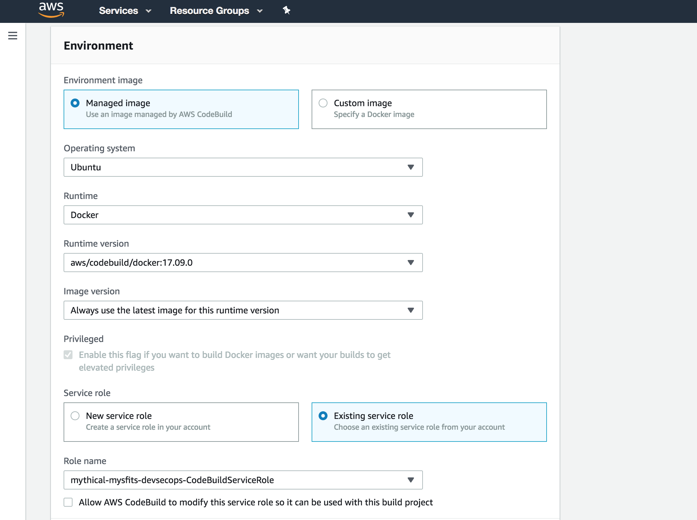
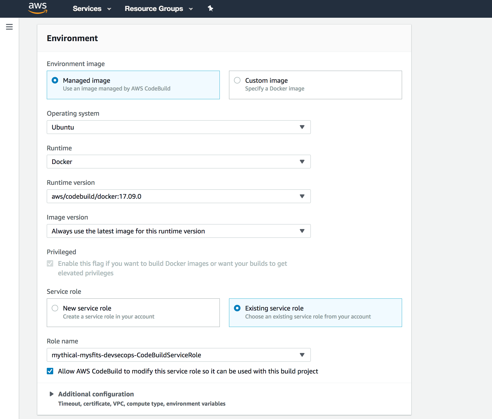
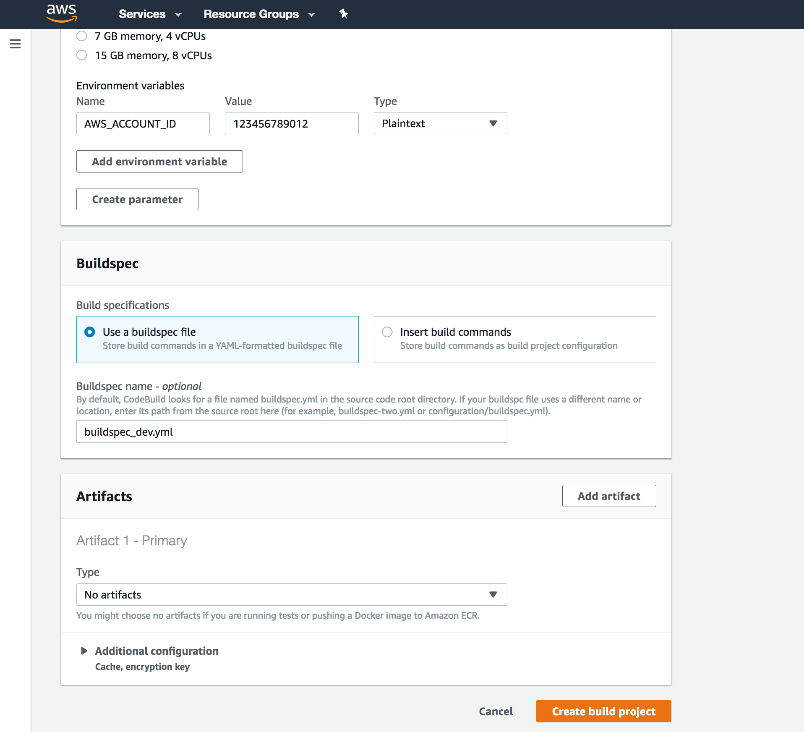
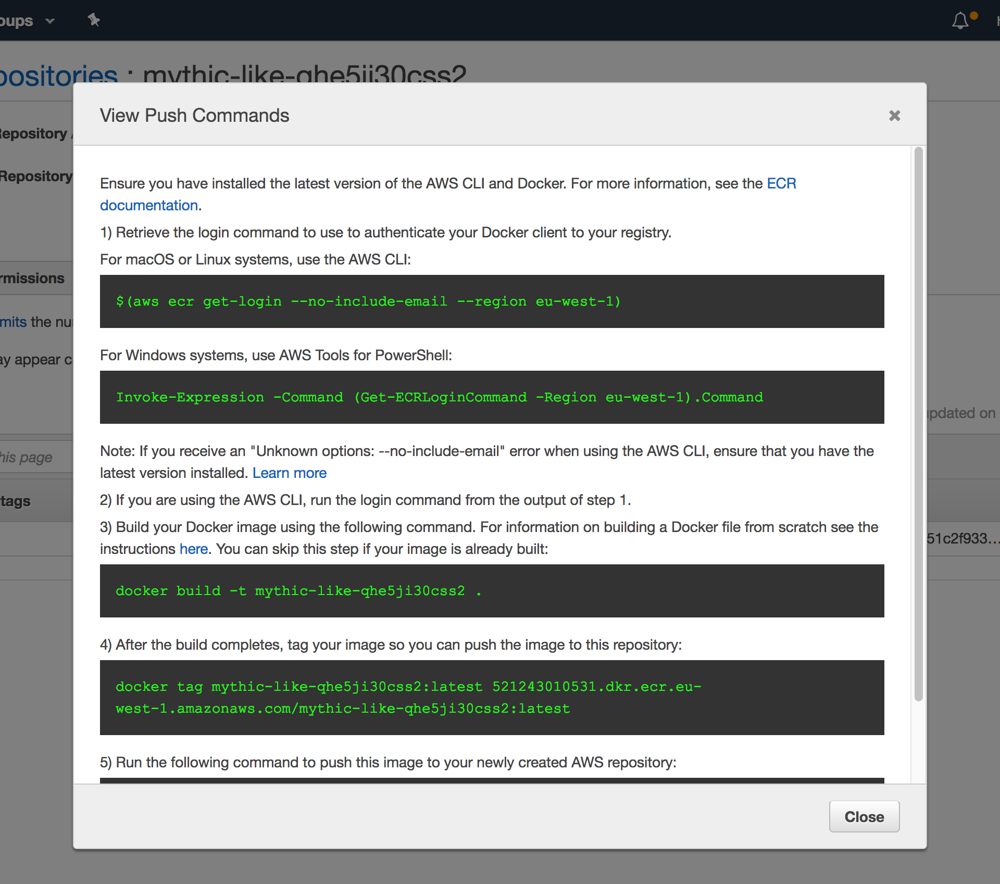

# Mythical Mysfits: DevSecOps with Docker and AWS Fargate

## Lab 2 - Offloading Builds to AWS CodeBuild

In this lab, you will start the process of automating the entire software delivery process. The first step we're going to take is to automate the Docker container builds and push the container image into the Elastic Container Registry. This will allow you to develop and not have to worry too much about build resources. We will use AWS CodeCommit and AWS CodeBuild to automate this process. Then, we'll create a continuous delivery pipeline for our Like service in AWS Fargate. 

You may be thinking, why would I want to offload my builds when I could just do it on my local machine. Well, this is going to be part of your full production pipeline. We'll use the same build system process as you will for production deployments. In the event that something is different on your local machine as it is within the full dev/prod pipeline, this will catch the issue earlier. You can read more about this by looking into **[Shift Left](https://en.wikipedia.org/wiki/Shift_left_testing)**.

Here's a reference architecture for what you'll be building:

Here's what you'll be doing:

* [Create AWS CodeBuild Project](#create-aws-codebuild-project)
* [Create BuildSpec File](#create-buildspec-file)
* [Test your AWS CodeBuild Project](#test-your-aws-codebuild-project)

### Create AWS CodeBuild Project

1\. Create and configure an AWS CodeBuild project.

We will be using AWS CodeBuild to offload the builds from the local Cloud9 instance. Let's create the AWS CodeBuild project. In the AWS Management Console, navigate to the [AWS CodeBuild dashboard](https://console.aws.amazon.com/codebuild/home). Click on **Create build project**.

On the **Create build project** page, enter in the following details:

- Project Name: Enter `dev-like-service-build`
- Source Provider: Select **AWS CodeCommit**
- Repository: Choose the repo from the CloudFormation stack that looks like StackName-**like-service**

**Environment:**

- Environment Image: Select **Managed Image** - *There are two options. You can either use a predefined Docker container that is curated by CodeBuild, or you can upload your own if you want to customize dependencies etc. to speed up build time*
- Operating System: Select **Ubuntu** - *This is the OS that will run your build*
- Runtime: Select **Docker** - *Each image has specific versions of software installed. See [Docker Images Provided by AWS CodeBuild](http://docs.aws.amazon.com/codebuild/latest/userguide/build-env-ref-available.html)*
- Runtime version: Select **aws/codebuild/docker:17.09.0** - *This will default to the latest*
- Image version: **Leave as is**
- Privileged: **Leave as is** - *You can't actually change anything here. In order for to run Docker inside a Docker container, you need to have elevated privileges*
- Service role: **Existing service role** - *A service role was automatically created for you via CFN*
- Role name: Choose **CFNStackName-CodeBuildServiceRole** - *Look for the service role that has the name of the CFN stack you created previously*
- Uncheck **Allow AWS CodeBuild to modify this service role so it can be used with this build project**

Expand the **Additional Information** and enter the following in Environment Variables:

- Name: `AWS_ACCOUNT_ID` - *Enter this string*
- Value: ***`REPLACEME_YOUR_ACCOUNT_ID`*** - *This is YOUR account ID*

**Buildspec:**

- Build Specification: Select **Use a buildspec file** - *We are going to provide CodeBuild with a buildspec file*
- Buildspec name: Enter `buildspec_dev.yml` - *we'll be using the same repo, but different buildspecs*

**Artifacts:**

- Type: Select **No artifacts** *If there are any build outputs that need to be stored, you can choose to put them in S3.*

Click **Create build project**.

2\. Get login, tag, and push commands for ECR

We now have the building blocks in place to start automating the builds of our Docker images. You should have previously found all the commands to push/pull from ECR, but if not, follow this. Otherwise, skip to Step 5 and create your Buildspec now. 

In the AWS Management Console, navigate to [Repositories](https://console.aws.amazon.com/ecs/home#/repositories) in the ECS dashboard. Click on the repository with "like" in the name.

Click on "View Push Commands" and copy the login, build, tag, and push commands to use later.

### Create BuildSpec File

1\. Create BuildSpec file

AWS CodeBuild uses a definition file called a buildspec Yaml file. The contents of the buildspec will determine what AWS actions CodeBuild should perform. The key parts of the buildspec are Environment Variables, Phases, and Artifacts. See [Build Specification Reference for AWS CodeBuild](http://docs.aws.amazon.com/codebuild/latest/userguide/build-spec-ref.html) for more details.

**At Mythical Mysfits, we want to follow best practices, so there are 2 requirements:**

1. We don't use the ***latest*** tag for Docker images. We have decided to use the Commit ID from our source control instead as the tag so we know exactly what image was deployed.

2. We want to use multiple buildspec files. One for dev, one for test, one for prod.

Another developer from the Mythical Mysfits team has started a buildspec_dev file for you, but never got to finishing it. Add the remaining instructions to the buildspec_dev.yml.draft file. The file should be in your like-service folder and already checked in. Let's create a dev branch and copy the draft to a buildspec_dev.yml file.

<pre>
$ cd ~/environment/<b><i>REPLACEME_LIKE_REPO_NAME</b></i>
$ git checkout -b dev
$ cp ~/environment/aws-modern-application-workshop/workshop-2/Lab-2/hints/buildspec_dev.yml.draft buildspec_dev.yml
</pre>

Now that you have a copy of the draft as your buildspec, you can start editing it. The previous developer left comments indicating what commands you need to add (<b>These comments look like - #[TODO]:</b>). Add the remaining instructions to your buildspec_dev.yml.  

Here are links to documentation and hints to help along the way. If you get stuck, look at the [hintspec_dev.yml](hints/hintspec_dev.yml) file in the hints folder:

<pre>
<b>#[TODO]: Command to log into ECR. Remember, it has to be executed $(maybe like this?)</b>

- http://docs.aws.amazon.com/AmazonECR/latest/userguide/Registries.html
- https://docs.aws.amazon.com/codebuild/latest/userguide/sample-docker.html#sample-docker-files

<b>#[TODO]: Build the actual image using the current commit ID as the tag...perhaps there's a CodeBuild environment variable we can use. Remember that we also added two custom environment variables into the CodeBuild project previously: AWS_ACCOUNT_ID. How can you use this?</b>

- https://docs.docker.com/get-started/part2/#build-the-app
- https://docs.aws.amazon.com/codebuild/latest/userguide/build-env-ref-env-vars.html

<b>#[TODO]: Tag the newly built Docker image so that we can push the image to ECR. See the instructions in your ECR console to find out how to do this. Make sure you use the current commit ID as the tag!</b>

<b>#[TODO]: Push the Docker image up to ECR</b>

- https://docs.aws.amazon.com/AmazonECR/latest/userguide/docker-push-ecr-image.html
- https://docs.docker.com/engine/reference/builder/#entrypoint
</pre>

  

    HINT: Click here for the completed buildspec.yml file.
  

  There are many ways to achieve what we're looking for. In this case, the buildspec looks like this:
<pre>
version: 0.2

phases:
  pre_build:
    commands:
      - echo Logging in to Amazon ECR...
      - REPOSITORY_URI=REPLACEME_REPO_URI # This was started. Just replace REPLACEME_REPO_URI with your ECR Repo URI
      - $(aws ecr get-login --no-include-email --region $AWS_DEFAULT_REGION) # <b><i>This is the login command from earlier</i></b>
  build:
    commands:
      - echo Build started on `date`
      - echo Building the Docker image...          
      - docker build -t $REPOSITORY_URI:$CODEBUILD_RESOLVED_SOURCE_VERSION . # <b><i>There are a number of variables that are available directly in the CodeBuild build environment. We specified IMAGE_REPO_NAME earlier, but CODEBUILD_SOURCE_VERSION is there by default.</i></b>
      - docker tag $REPOSITORY_URI:$CODEBUILD_RESOLVED_SOURCE_VERSION $REPOSITORY_URI:$CODEBUILD_RESOLVED_SOURCE_VERSION # <b><i>This is the tag command from earlier</i></b>
  post_build:
    commands:
      - echo Build completed on `date`
      - echo Pushing the Docker image...
      - docker push $REPOSITORY_URI:$CODEBUILD_RESOLVED_SOURCE_VERSION # <b><i>This is the push command from earlier</i></b>
</pre>
 

You can copy a pre-created one into your application directory. If you do, make sure you replace the REPOSITORY_URI with the one from your like-service ECR repository!
<pre>
$ cp ~/environment/aws-modern-application-workshop/workshop-2/Lab-2/hints/hintspec_dev.yml buildspec_dev.yml
</pre>

When we created the buildspec_dev.yml file, we used CODEBUILD_RESOLVED_SOURCE_VERSION. What is CODEBUILD_RESOLVED_SOURCE_VERSION and why didn't we just use CODEBUILD_SOURCE_VERSION? You can find out in the [Environment Variables for Build Environments](http://docs.aws.amazon.com/codebuild/latest/userguide/build-env-ref-env-vars.html) documentation. 

  

    HINT: Click here for a spoiler!
  

    For Amazon S3, the version ID associated with the input artifact. For AWS CodeCommit, the commit ID or branch name associated with the version of the source code to be built. For GitHub, the commit ID, branch name, or tag name associated with the version of the source code to be built. Since we will be triggering the build from CLI, the source version passed to CodeBuild will be 'dev', so that's what would show up if you use CODEBUILD_SOURCE_VERSION. Since we are using CODEBUILD_RESOLVED_SOURCE_VERSION, you will see the actual HEAD commit ID for our dev branch. 
    

 

### Test Your AWS CodeBuild Project

1\. Check in your new file into the AWS CodeCommit repository.

Make sure the name of the file is buildspec_dev.yml and then run these commands:

<pre>
$ git add buildspec_dev.yml
$ git commit -m "Adding in support for AWS CodeBuild"
[dev 6755244] Adding in support for AWS CodeBuild
$ git push origin dev
Counting objects: 8, done.
Compressing objects: 100% (7/7), done.
Writing objects: 100% (8/8), 1.07 KiB | 546.00 KiB/s, done.
Total 8 (delta 1), reused 0 (delta 0)
To https://git-codecommit.eu-west-1.amazonaws.com/v1/repos/mythical-mysfits-devsecops-like-service
 * [new branch]      dev -> dev
</pre>

2\. Test your build.
<pre>
$ aws codebuild start-build --project-name dev-like-service-build --source-version dev
{
    "build": {
        "environment": {
            "computeType": "BUILD_GENERAL1_SMALL", 
            "privilegedMode": true, 
            "image": "aws/codebuild/docker:17.09.0", 
            "type": "LINUX_CONTAINER", 
            "environmentVariables": [
                {
                    "type": "PLAINTEXT", 
                    "name": "AWS_ACCOUNT_ID", 
                    "value": "123456789012"
                }, 
                {
                    "type": "PLAINTEXT", 
                    "name": "IMAGE_REPO_NAME", 
                    "value": "mythical-mysfits-devsecops/like-service"
                }
            ]
        }, 
        "phases": [
            {
                "phaseStatus": "SUCCEEDED", 
                "endTime": 1542597587.613, 
                "phaseType": "SUBMITTED", 
                "durationInSeconds": 0, 
                "startTime": 1542597587.318
            }, 
            {
                "phaseType": "QUEUED", 
                "startTime": 1542597587.613
            }
        ], 
        "timeoutInMinutes": 60, 
        "buildComplete": false, 
        "logs": {
            "deepLink": "https://console.aws.amazon.com/cloudwatch/home?region=eu-west-1#logEvent:group=null;stream=null"
        }, 
        "serviceRole": "arn:aws:iam::123456789012:role/service-role/codebuild-dev-like-service-build-service-role", 
        "artifacts": {
            "location": ""
        }, 
        "projectName": "dev-like-service-build", 
        "cache": {
            "type": "NO_CACHE"
        }, 
        "initiator": "IsengardAdministrator/hubertc-Isengard", 
        "buildStatus": "IN_PROGRESS", 
        "sourceVersion": "6755244", 
        "source": {
            "buildspec": "buildspec_dev.yml", 
            "gitCloneDepth": 1, 
            "type": "CODECOMMIT", 
            "location": "https://git-codecommit.eu-west-1.amazonaws.com/v1/repos/mythical-mysfits-devsecops-like-service", 
            "insecureSsl": false
        }, 
        "currentPhase": "QUEUED", 
        "startTime": 1542597587.318, 
        "id": "dev-like-service-build:53be8027-f831-4a5e-8888-41d757e26392", 
        "arn": "arn:aws:codebuild:eu-west-1:123456789012:build/dev-like-service-build:53be8027-f831-4a5e-8888-41d757e26392", 
        "encryptionKey": "arn:aws:kms:eu-west-1:123456789012:alias/aws/s3"
    }
}
</pre>

3\. Get status of build

Within the return data, you should see an 'id' section. This is the build ID. In the previous example, it was mythicalmysfits-build:8c1d38a6-39f6-41b8-8360-a34d8042640b. You can either query this build ID using the CLI or visit the CodeBuild console. To find logs about what happened, visit the 'deeplink' link that will bring you directly to CloudWatch logs console where you can view logs.

<pre>
$ aws codebuild batch-get-builds --ids 'dev-like-service-build:53be8027-f831-4a5e-8888-41d757e26392'
...
            "currentPhase": "COMPLETED", 
            "startTime": 1542597587.318, 
            "endTime": 1542597706.584, 
            "id": "dev-like-service-build:53be8027-f831-4a5e-8888-41d757e26392", 
            "arn": "arn:aws:codebuild:eu-west-1:123456789012:build/dev-like-service-build:53be8027-f831-4a5e-8888-41d757e26392", 
            "encryptionKey": "arn:aws:kms:eu-west-1:123456789012:alias/aws/s3"
        }
    ]
}
</pre>

If all goes well, you should see a lot of successes in the logs and your image in the ECR console. Inspect the **Build Log** if there were any failures. You'll also see these same logs in the CloudWatch Logs console. This will take a few minutes.

What CodeBuild has done is follow the steps in your buildspec. If you refresh your ECR Repository, you should see a new image that was built, tagged and pushed by CodeBuild.

Now that you are sure that the image can be built in the same environment as production you can test the new image.

# Checkpoint 

At this point, you have begun the CI/CD process by offloading your builds to make sure the actual production-esque build environment can handle whatever you're going to throw it it. That way, if something goes wrong, you're not trying to push to production or any other environment. You can catch those errors earlier. You've also started building in best practices by not using the :latest tag in Docker. It's very common for beginners to use the :latest tag, but the challenge is that when you do that you don't know exactly what you're deploying without comparing the SHA hash of your image with whatever you have locally. 

You're now ready to build in end to end deployments! 

Proceed to [Lab 3](../Lab-3)!

