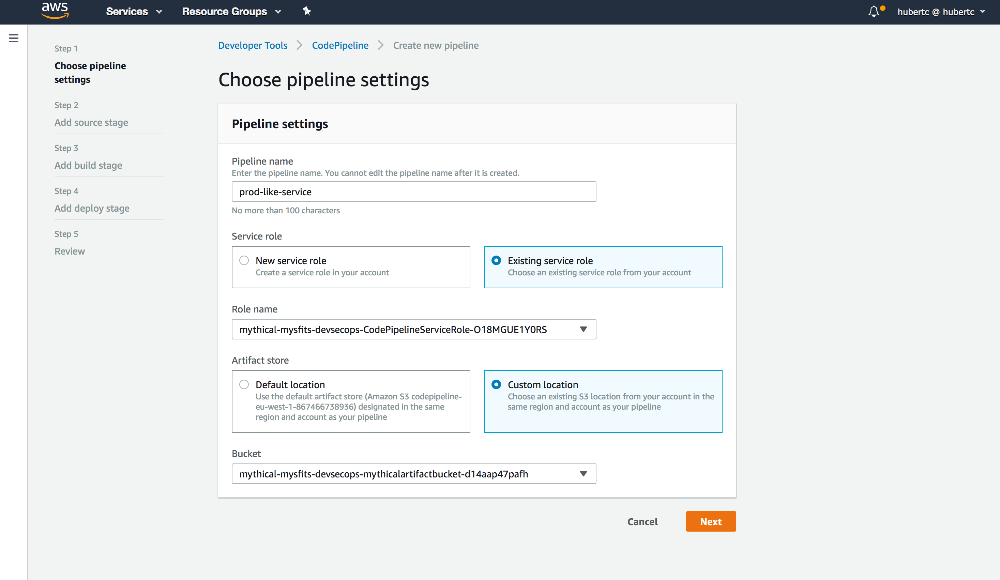
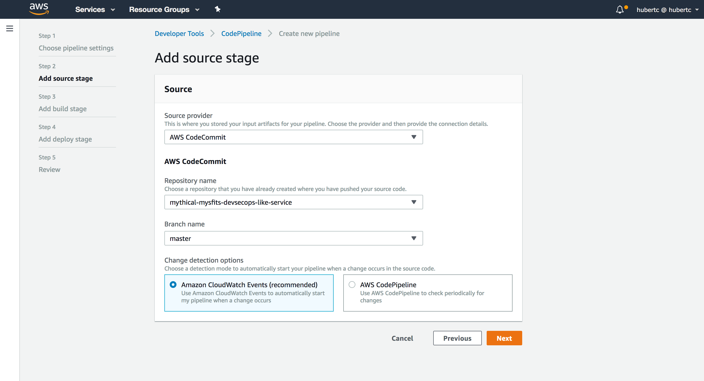
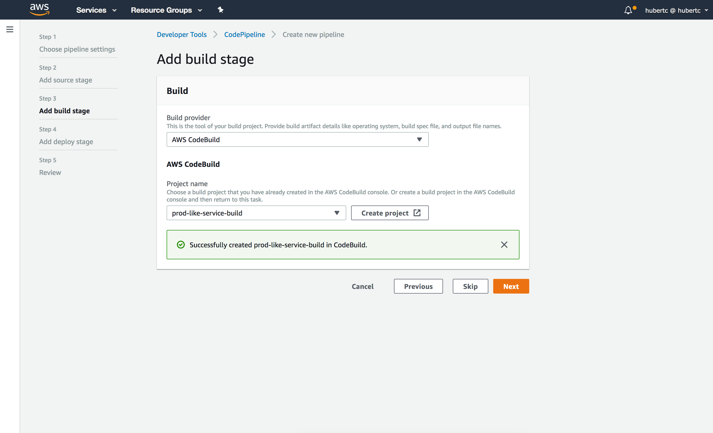
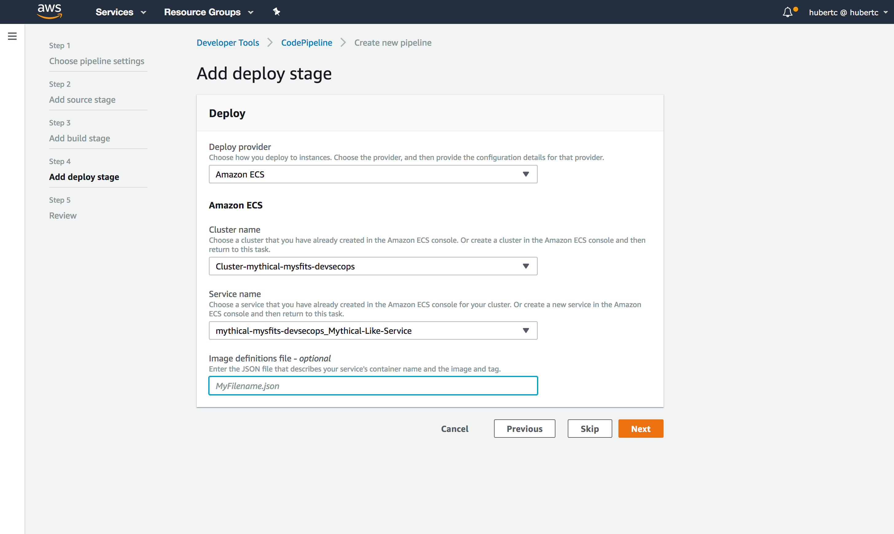
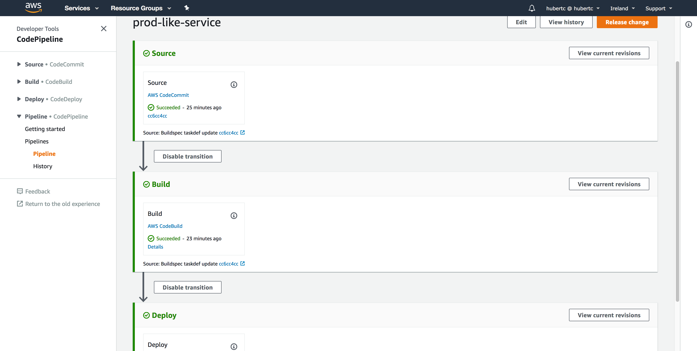

# Mythical Mysfits: DevSecOps with Docker and AWS Fargate

## Lab 3 - Automating End to End Deployments for AWS Fargate

In this lab, you will implement the end to end deployment and testing process for your like service. This lab is where it all comes together. By the end, you will be able to check in new code and have your application automatically updated.

Here's what you'll be doing:

* Create new buildspec and merge feature branch
* Create Pipeline for deployments
* Deploy new version of Project Cuddle

### Create new buildspec and merge feature branch

1\. Create the buildspec_prod.yml file

In Lab 2, we created a buildspec for dev named buildspec_dev. That was used when CodeBuild was run directly on source code in CodeCommit, but now for production we want to build a full pipeline that will automatically deploy our environment, so we'll use CodePipeline to orchestrate that. 

Ideally, we want to keep production and development branches as similar as possible, but want to control differences between dev and prod build stages. To start, we can basically copy over what we created for Lab 2, but there will be a few minor changes. We will name the new buildspec buildspec_prod.yml instead of buildspec_dev.yml.

Make sure you're in the like repository folder, which should be named something like **CFNStackName-like-service**. 

<pre>
$ cd ~/environment/<b>REPLACE_ME_LIKE_REPOSITORY_NAME</b>
$ cp buildspec_dev.yml buildspec_prod.yml
</pre>

Next, in order for CodePipeline to deploy to Fargate, we need to have an `imagedefinitions.json` file that includes the name of the container we want to replace as well as the imageUri. Then we have to surface the file to CodePipeline in an Artifacts section. The end of your buildspec_prod.yml file will look like this:

<pre>
...
    post_build:
      commands:
        - echo Build completed on `date`
        - echo Pushing the Docker image...
        - docker push $REPOSITORY_URI:$CODEBUILD_RESOLVED_SOURCE_VERSION
        - printf '[{"name":"REPLACEME_CONTAINERNAME","imageUri":"%s"}]' $REPOSITORY_URI:$CODEBUILD_RESOLVED_SOURCE_VERSION > imagedefinitions.json
artifacts:
  files: imagedefinitions.json
</pre>

Replace the container name with the name of your service, which should be `like-service`.

 HINT: There's also completed file in hints/hintspec_prod.yml. Click here to see how to copy it in.

  Make sure you change REPLACEME_REPO_URI to your ECR repository URI!
  <pre>
  $ cp ~/environment/aws-modern-application-workshop-staging/workshop-2/Lab-3/hints/buildspec_prod.yml ~/environment/REPLACEME_REPO_NAME/buildspec_prod.yml
  </pre>

2\. Check in and push to dev

Add, commit, and push the new file to your repo. You can try to build the app again, but CodeBuild will just do the same thing because it's still looking at buildspec_dev.yml.

<pre>
  $ git add buildspec_prod.yml
  $ git commit -m "Adding a buildspec for prod"
  $ git push origin dev
</pre>

3\. Merge into master branch

Now that we're ready with all the code let's merge with our master branch. The master branch is what we're going to use to trigger all CodePipeline deployments

First switch back to your master branch:
<pre>
  $ git checkout master
</pre>

Next, merge in all your changes:

<pre>
  $ git merge dev
  $ git push origin master
</pre>

### Create Pipeline for deployments

1\. Create an AWS CodePipeline Pipeline and set it up to listen to AWS CodeCommit.

Now it's time to hook everything together. In the AWS Management Console, navigate to the [AWS CodePipeline](https://console.aws.amazon.com/codepipeline/home#/) dashboard. Click on **Create Pipeline**.

On the following pages, enter the following details:

**Choose pipeline settings:**

- Pipeline name: `prod-like-service` - *This is a production pipeline, so we'll prefix with prod*
- Service role: **Existing service role** - *A service role was automatically created for you via CFN*
- Role name: Choose **CFNStackName-CodeBuildServiceRole** - *Look for the service role that has the name of the CFN stack you created previously*
- Artifact store: Choose **Custom location** - *An artifact bucket was created for you via CFN*
- Bucket: Choose **CFNStackName-mythicalartifactbucket** - *Look for the artifact bucket that has the name of the CFN stack you created previously. Note that there are two buckets that were created for you. Look for the one that says mythicalartifactbucket*

Click **Next**

**Add source stage:**

- Source provider: **AWS CodeCommit** - *We checked in our code to CodeCommit, so that's where we'll start. CodePipeline also supports a variety of different source providers. Try them out later!*
- Repository name: **CFNStackName-like-service** - *Name of your CodeCommit repo for the like-service*
- Branch name: **master** - *We want this to automatically trigger when we push to the master branch in our repo*
- Change detection options: **Amazon CloudWatch Events (recommended)** - *You have the option of using CodePipeline to poll CodeCommit for changes every minute, but using CloudWatch Events will trigger CodePipeline executions based on events, so it's much faster*

Click **Next**.

**Add build stage:**

- Build provider: **AWS CodeBuild**
- Project name: Click **Create a new build project**

A new window should appear. The values here are almost identical to that of Lab-2 when you created your dev CodeBuild project, with the exception that the name is now prod-like-service-build and the buildspec will be buildspec_prod.yml. See Lab-2 instructions for detailed screenshots.

**Create build project:**

- Project name: `prod-like-service-build` 
- Environment Image: Select **Managed Image** - *There are two options. You can either use a predefined Docker container that is curated by CodeBuild, or you can upload your own if you want to customize dependencies etc. to speed up build time*
- Operating System: Select **Ubuntu** - *This is the OS that will run your build*
- Runtime: Select **Docker** - *Each image has specific versions of software installed. See [Docker Images Provided by AWS CodeBuild](https://docs.aws.amazon.com/codebuild/latest/userguide/build-env-ref-available.html)*
- Runtime version: Select **aws/codebuild/docker:17.09.0** - *This will default to the latest*
- Image version: **Leave as is**
- Privileged: **Leave as is** - *You can't actually change anything here. In order for to run Docker inside a Docker container, you need to have elevated privileges*
- Service role: **Existing service role** - *A service role was automatically created for you via CFN*
- Role name: Choose **CFNStackName-CodeBuildServiceRole** - *Look for the service role that has the name of the CFN stack you created previously. It will be in the form of **CFNStackName**-CodeBuildServiceRole*

- Uncheck **Allow AWS CodeBuild to modify this service role so it can be used with this build project**

Expand the **Additional Information** and enter the following in Environment Variables:

- Name: `AWS_ACCOUNT_ID` - *Enter this string*
- Value: ***`REPLACEME_YOUR_ACCOUNT_ID`*** - *This is YOUR account ID*

**Buildspec:**

- Build Specification: Select **Use a buildspec file** - *We are going to provide CodeBuild with a buildspec file*
- Buildspec name: Enter `buildspec_prod.yml` - *Using our new buildspec*

Once confirmed, click **Continue to CodePipeline**. This should close out the popup and tell you that it **successfully created prod-like-service-build in CodeBuild.** 

- Project Name: **prod-like-service-build**

Click **Next**.

**Add deploy stage:**

- Deployment provider: Select **Amazon ECS** - *This is the mechanism we're choosing to deploy with. CodePipeline also supports several other deployment options, but we're using ECS directly in this case.*
- Cluster Name: Select your ECS Cluster. In my case, **Cluster-mythical-mysfits-devsecops** - *This is the cluster that CodePipeline will deploy into.*
- Service Name: Enter `CFNStackName-Mythical-like-service` - *Name the CloudFormation stack that you're going to create/update*
- Image definitions file - *optional*: Enter `imagedefinitions.json` - *This is the file we created within the buildspec_prod.yml file earlier*

Click **Next**.

Review your details and click **Create Pipeline**.

5\. Test your pipeline.

By default, when you create your pipeline, CodePipeline will automatically run through and try to deploy your application. If you see it go through all three stages with all GREEN, you're good to go. Otherwise, click into the links it gives you and troubleshoot the deployment. 

## Deploy new version of Project Cuddle

Now that you have your application deploying automatically, let's deploy a new version! We've upgraded the health check for our like service to make sure it can connect to the monolith service for the fulfillment method.

<pre>
$ cd ~/environment/REPLACEME_LIKE_REPO
$ cp ~/environment/aws-modern-application-workshop/workshop-2/Lab-3/mysfits_like_v2.py service/mysfits_like.py
$ git add service/mysfits_like.py
$ git commit -m "Cuddles v2"
$ git push origin master
</pre>

Now sit back, relax, and watch the deployment. When it's done, congratulations! You've unlocked the automated build and deploy achievement! Next up, head on over to [Lab 4](../Lab-4) for the "Sec" in DevSecOps.
