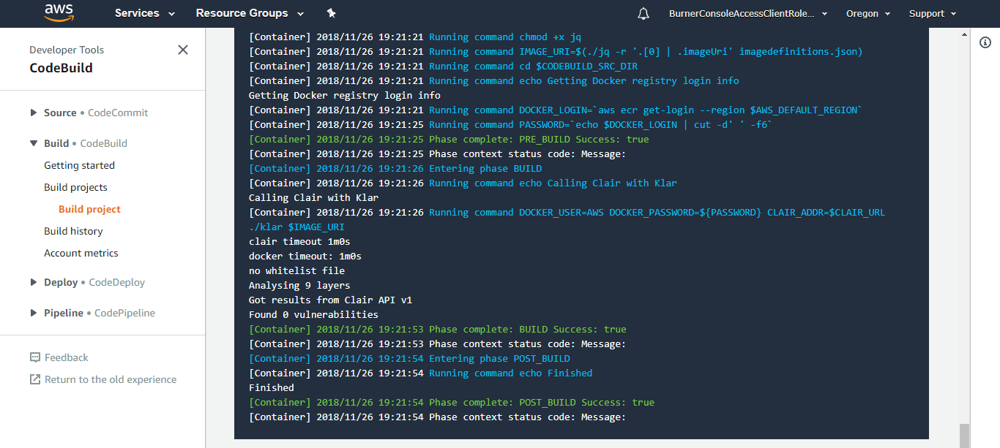
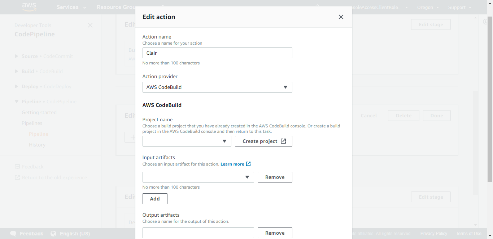

# Mythical Mysfits: DevSecOps with Docker and AWS Fargate

## TODO - massage everything to make sense in the prod pipeline

## Lab 4: Implement Container Image scanning

In this lab we will really put the Sec in DevSecOps by including Clair, a static vulnerability scanner for container images. Clair is a service that requires a Postgres DB and a running container. Because we know you already know how to stand up ECS services we've already stood up the Clair service for you in the core.yml CloudFormation template. Now we're going to add another CodeBuild project to run Clair via a tool called Klar, add a test phase to the pipeline we created in Lab 3, then run our CodeBuild project in that test phase.

Why would we use Clair? Injecting automated security into the pipeline gives you the same benefit as automated test - the ability to move quickly with confidence that you haven't regressed on security.

Here's a reference architecture for what you'll be building:

Here's what you'll be doing:

## TODO ToC

### Create AWS CodeBuild Project
1\. Create and configure an AWS CodeBuild project.

This will be very similar to what we did in Lab 2. This CodeBuild project will represent our test phase. In the AWS Management Console, navigate to the [AWS CodeBuild dashboard](https://console.aws.amazon.com/codebuild/home). Click on **Create build project**.

On the **Create build project** page, enter in the following details:

- Project Name: Enter `prod-like-service-test`
- Source Provider: Select **AWS CodeCommit**
- Repository: Choose the repo from the CloudFormation stack that looks like StackName-**like-service**

**Environment:**

- Environment Image: Select **Managed Image** - *There are two options. You can either use a predefined Docker container that is curated by CodeBuild, or you can upload your own if you want to customize dependencies etc. to speed up build time*
- Operating System: Select **Ubuntu** - *This is the OS that will run your build*
- Runtime: Select **Docker** - *Each image has specific versions of software installed. See [Docker Images Provided by AWS CodeBuild](http://docs.aws.amazon.com/codebuild/latest/userguide/build-env-ref-available.html)*
- Runtime version: Select **aws/codebuild/docker:17.09.0** - *This will default to the latest*
- Image version: **Leave as is**
- Privileged: **Leave as is** - *You can't actually change anything here. In order for to run Docker inside a Docker container, you need to have elevated privileges*
- Service role: **Existing service role** - *A service role was automatically created for you via CFN*
- Role name: Choose **CFNStackName-CodeBuildServiceRole** - *Look for the service role that has the name of the CFN stack you created previously*

Expand the **Additional Information** and enter the following in Environment Variables:

- Name: `AWS_ACCOUNT_ID` - *Enter this string*
- Value: ***`REPLACEME_YOUR_ACCOUNT_ID`*** - *This is YOUR account ID*

**Buildspec:**

- Build Specification: Select **Use a buildspec file** - *We are going to provide CodeBuild with a buildspec file*
- Buildspec name: Enter `buildspec_clair.yml` - *we'll be using the same repo, but different buildspecs*

**Artifacts:**

- Type: Select **No artifacts** *If there are any build outputs that need to be stored, you can choose to put them in S3.*

Click **Create build project**.

2\. Get the login command and repository URI for ECR

Klar needs a login and URI for the Docker repository where our image is stored. If you don't already have these from a previous lab, follow this step to get that login. Otherwise, skip this and create your Buildspec now. 

In the AWS Management Console, navigate to [Repositories](https://console.aws.amazon.com/ecs/home#/repositories) in the ECS dashboard. Click on the repository with "like" in the name.

Click on "View Push Commands" and copy the login command for use later. Also make sure you grab the repoistory URI if you don't already have it saved.

### Create BuildSpec File

1\. Create BuildSpec file

Just like in Lab 2, we're going to create a buildspec for running Clair. See [Build Specification Reference for AWS CodeBuild](http://docs.aws.amazon.com/codebuild/latest/userguide/build-spec-ref.html) for more details on the buildspec format.

Our intern from last summer got started with Clair but didn't finish before she went back to school. Her buildspec is almost ready to rock but you'll need to finish one last detail.

<pre>
$ cd ~/environment/<b><i>REPLACEME_LIKE_REPO_NAME</b></i>
$ git checkout -b clair 
$ cp ~/environment/aws-modern-application-workshop-STAGING/workshop-2/Lab-4/hints/buildspec_clair.yml buildspec_clair.yml
</pre>

Now that you have a copy of the draft as your buildspec, you can start editing it. The only thing you need to do is update "REPLACE_ME_REPO_URI" with your ECR repo URI.

## TODO update this with final buildspec
<pre>
version: 0.2

phases:
  pre_build:
    commands:
      - echo Logging in to Amazon ECR...
      - REPOSITORY_URI=REPLACEME_REPO_URI # This was started. Just replace REPLACEME_REPO_URI with your ECR Repo URI
      - $(aws ecr get-login --no-include-email --region $AWS_DEFAULT_REGION) # <b><i>This is the login command from earlier</i></b>
  build:
    commands:
      - echo Build started on `date`
      - echo Building the Docker image...          
      - docker build -t $REPOSITORY_URI:$CODEBUILD_RESOLVED_SOURCE_VERSION . # <b><i>There are a number of variables that are available directly in the CodeBuild build environment. We specified IMAGE_REPO_NAME earlier, but CODEBUILD_SOURCE_VERSION is there by default.</i></b>
      - docker tag $REPOSITORY_URI:$CODEBUILD_RESOLVED_SOURCE_VERSION $REPOSITORY_URI:$CODEBUILD_RESOLVED_SOURCE_VERSION # <b><i>This is the tag command from earlier</i></b>
  post_build:
    commands:
      - echo Build completed on `date`
      - echo Pushing the Docker image...
      - docker push $REPOSITORY_URI:$CODEBUILD_RESOLVED_SOURCE_VERSION # <b><i>This is the push command from earlier</i></b>
</pre>
 

### Test Your AWS CodeBuild Project

1\. Check in your new file into the AWS CodeCommit repository.

Make sure the name of the file is buildspec_clair.yml and then run these commands:

<pre>
$ git add buildspec_clair.yml
$ git commit -m "Adding in support for AWS CodeBuild"
[clair 6755244] Adding in support for Clair 
$ git push origin clair 
Counting objects: 8, done.
Compressing objects: 100% (7/7), done.
Writing objects: 100% (8/8), 1.07 KiB | 546.00 KiB/s, done.
Total 8 (delta 1), reused 0 (delta 0)
To https://git-codecommit.eu-west-1.amazonaws.com/v1/repos/mythical-mysfits-devsecops-like-service
 * [new branch]      clair -> clair 
</pre>

## TODO - replace with output from actual run
2\. Test your build.
<pre>
$ aws codebuild start-build --project-name prod-like-service-test --source-version clair
{
    "build": {
        "environment": {
            "computeType": "BUILD_GENERAL1_SMALL", 
            "privilegedMode": true, 
            "image": "aws/codebuild/docker:17.09.0", 
            "type": "LINUX_CONTAINER", 
            "environmentVariables": [
                {
                    "type": "PLAINTEXT", 
                    "name": "AWS_ACCOUNT_ID", 
                    "value": "123456789012"
                }, 
                {
                    "type": "PLAINTEXT", 
                    "name": "IMAGE_REPO_NAME", 
                    "value": "mythical-mysfits-devsecops/like-service"
                }
            ]
        }, 
        "phases": [
            {
                "phaseStatus": "SUCCEEDED", 
                "endTime": 1542597587.613, 
                "phaseType": "SUBMITTED", 
                "durationInSeconds": 0, 
                "startTime": 1542597587.318
            }, 
            {
                "phaseType": "QUEUED", 
                "startTime": 1542597587.613
            }
        ], 
        "timeoutInMinutes": 60, 
        "buildComplete": false, 
        "logs": {
            "deepLink": "https://console.aws.amazon.com/cloudwatch/home?region=eu-west-1#logEvent:group=null;stream=null"
        }, 
        "serviceRole": "arn:aws:iam::123456789012:role/service-role/codebuild-dev-like-service-build-service-role", 
        "artifacts": {
            "location": ""
        }, 
        "projectName": "dev-like-service-build", 
        "cache": {
            "type": "NO_CACHE"
        }, 
        "initiator": "IsengardAdministrator/hubertc-Isengard", 
        "buildStatus": "IN_PROGRESS", 
        "sourceVersion": "6755244", 
        "source": {
            "buildspec": "buildspec_dev.yml", 
            "gitCloneDepth": 1, 
            "type": "CODECOMMIT", 
            "location": "https://git-codecommit.eu-west-1.amazonaws.com/v1/repos/mythical-mysfits-devsecops-like-service", 
            "insecureSsl": false
        }, 
        "currentPhase": "QUEUED", 
        "startTime": 1542597587.318, 
        "id": "dev-like-service-build:53be8027-f831-4a5e-8888-41d757e26392", 
        "arn": "arn:aws:codebuild:eu-west-1:123456789012:build/dev-like-service-build:53be8027-f831-4a5e-8888-41d757e26392", 
        "encryptionKey": "arn:aws:kms:eu-west-1:123456789012:alias/aws/s3"
    }
}
</pre>

## TODO - update all of this with real outputs
3\. Get status of build

Within the return data, you should see an 'id' section. This is the build ID. In the previous example, it was mythicalmysfits-build:8c1d38a6-39f6-41b8-8360-a34d8042640b. You can either query this build ID using the CLI or visit the CodeBuild console. To find logs about what happened, visit the 'deeplink' link that will bring you directly to CloudWatch logs console where you can view logs.

<pre>
$ aws codebuild batch-get-builds --ids 'prod-like-service-test:53be8027-f831-4a5e-8888-41d757e26392'
...
            "currentPhase": "COMPLETED", 
            "startTime": 1542597587.318, 
            "endTime": 1542597706.584, 
            "id": "dev-like-service-build:53be8027-f831-4a5e-8888-41d757e26392", 
            "arn": "arn:aws:codebuild:eu-west-1:123456789012:build/dev-like-service-build:53be8027-f831-4a5e-8888-41d757e26392", 
            "encryptionKey": "arn:aws:kms:eu-west-1:123456789012:alias/aws/s3"
        }
    ]
}
</pre>

If all goes well, you should see that Clair inspected your image and didn't find anything wrong. Inspect the **Build Log** if there was a failure. You'll also see these same logs in the CloudWatch Logs console. This will take a few minutes.

### Add your CodeBuild project into CodePipeline as the test step

Next up we'll add our new CodeBuild project to the pipeline as a test phase.

1\. In the AWS Management Console, navigate to the [AWS CodePipeline](https://console.aws.amazon.com/codepipeline/home#/) dashboard. Choose the pipeline you created in Lab 3, which should be named prod-like-service, then choose Edit in the upper right.

We're going to add a new stage, test, between the Build and Deploy stages. Scroll down and choose "Add Stage" between Build and Deploy. Name the stage Test. A new stage will appear, Test. Choose "Add action group". Name the new action "Clair" and choose CodeBuild from the dropdown. New fields will appear - select the prod-like-service-test project from the "Project Name" dropdown, select BuildArtifact from the input artifacts dropdown, and leave your output artifacts empty. Save the action, choose Done to finish editing the stage, then choose Save to save the entire pipeline.

From here, any run of the pipeline will include an automated security check to look for CVEs and other vulnerabilities. Congratulations! You've finished the second workshop in this track. If you're heading on to the last workshop in the series, feel free to leave everything as is.

Whether you move on to the next workshop or wrap up here, make sure you  when you're done!
