Management and Operations with AWS Fargate
====================================================

Welcome to the Mythical Mysfits team!

Mytical Mysfits is an adoption center for abandoned, often misunderstood mythical creatures in our community.  The Mysfits dev team began the process of modernizing our stack through containerization and taking strides towards a microservices architecture.  The like functionality of our main web application is a really helpful, popular feature for folks thinking about adoption, so we opted for that to be our first microservice pulled out of the monolith codebase.  It is now running as a microservice and deployed with AWS Fargate, a launch type of Amazon ECS.  

Things have been humming along, though we've recently received reports of unusual behavior with the web application, specifically with the like functionality.  Containers are a bit new to the ops team, so we need your help to explore observability of the Like microservice now that it's running on Fargate.  This means we need to think about monitoring, how we analyze logs, what sort of tracing capabilities are available (this will be very important when we launch more microservices that could potentially call out to each other), and how can we have an operational dashboard with useful alerting for on-call.  

Can you help us figure out what the unusual behavior might be?

### Requirements:

* AWS account - if you don't have one, it's easy and free to [create one](https://aws.amazon.com/).
* AWS IAM account with elevated privileges allowing you to interact with CloudFormation, IAM, EC2, ECS, ECR, ELB/ALB, VPC, SNS, CloudWatch, Cloud9, Elasticsearch Service, X-Ray. [Learn how](https://docs.aws.amazon.com/IAM/latest/UserGuide/id_users_create.html).
* Familiarity with [Python](https://wiki.python.org/moin/BeginnersGuide/Programmers), [Docker](https://www.docker.com/), and [AWS](httpts://aws.amazon.com) - *not required but a bonus*.

### What you'll do:

These labs are designed to be completed in sequence, and the full set of instructions are documented below.  Read and follow along to complete the labs.  If you're at a live AWS event, the workshop staff will give you a high-level overview of the labs and help answer any questions.  Don't worry if you get stuck, we provide hints along the way.

* **Workshop Setup:** [Setup working environment on AWS](#lets-begin)
* **Lab 1:** [Exploring The Task metadata endpoint](#lab-1---exploring-the-task-metadata-endpoint)
* **Lab 2:** [Log Analysis with CloudWatch Logs and Elasticsearch](#lab-2---log-analysis-with-CloudWatch-Logs-and-Elasticsearch)
* **Lab 3:** [Distributed Tracing and Debugging with AWS X-Ray](#lab-3---distributed-tracing-and-debugging-with-aws-x-ray)
* **Lab 4:** [Implementing Task Auto-Scaling](#lab-4-implementing-task-auto-scaling)
<!-- * **Lab 5:** [Visualising all the things with CloudWatch Dashboards](#lab-5-visualising-all-the-things-with-cloudwatch-dashboards)-->
* **Cleanup** [Put everything away nicely](#workshop-cleanup)

### Conventions:

Throughout this workshop, we will provide commands for you to run in the terminal.  These commands will look like this:

<pre>
$ ssh -i <b><i>PRIVATE_KEY.PEM</i></b> ec2-user@<b><i>EC2_PUBLIC_DNS_NAME</i></b>
</pre>

The command starts after the `$`.  Text that is ***UPPER_ITALIC_BOLD*** indicates a value that is unique to your environment.  For example, ***PRIVATE\_KEY.PEM*** refers to the private key of an SSH key pair that you've created in your account, and ***EC2\_PUBLIC\_DNS\_NAME*** is a value that is specific to an EC2 instance launched in your account.  You can find these unique values either in the CloudFormation outputs or by navigating to the specific service dashboard in the [AWS management console](https://console.aws.amazon.com).

Hints are also provided along the way and will look like this:

<details>
<summary>HINT</summary>

**Nice work, you just revealed a hint!**
</details>

*Click on the arrow above to show the contents of the hint.*

The instructions will refer to resources provisioned by the workshop CloudFormation (CFN) template you ran earlier.  Open the [CloudFormation dashboard](https://console.aws.amazon.com/cloudformation/home#/stacks?filter=active&tab=outputs) in a new browser tab, select the workshop stack, and keep this browser tab open for your reference throughout the workshop.

Also here are some acronyms you may see throughout the instructions:
- CloudFormation = CFN
- Elasticsearch = ES
- CloudWatch Logs = CWL

### IMPORTANT: Workshop Cleanup

You will be deploying infrastructure on AWS which will have an associated cost. If you're attending an AWS event, credits will be provided.  When you're done with the workshop, [follow the steps at the very end of the instructions](#workshop-cleanup) to make sure everything is cleaned up and to avoid unnecessary charges.

## Let's Begin!

### Workshop Setup:

1. Open the CloudFormation launch template link below in a new tab. The link will load the CloudFormation Dashboard and start the stack creation process in the chosen region:

    Click on one of the Deploy to AWS icons below to region to stand up the core workshop infrastructure.

    Region | Launch Template
    ------------ | -------------  
    **EU (Ireland)** (eu-west-1) | [](https://console.aws.amazon.com/cloudformation/home?region=eu-west-1#/stacks/new?stackName=mysfits-ops&templateURL=https://s3.amazonaws.com/mythical-mysfits-website/fargate-ops/core.yml)
    **Asia Pacific (Singapore)** (ap-southeast-1) | [](https://console.aws.amazon.com/cloudformation/home?region=ap-southeast-1#/stacks/new?stackName=mysfits-ops&templateURL=https://s3.amazonaws.com/mythical-mysfits-website/fargate-ops/core.yml)

2. The template will automatically bring you to the CloudFormation Dashboard and start the stack creation process in the specified region. The stack name is pre-populated, but feel free to change it to a unique value within your account. **Ensure you enter a valid email address for the CognitoAdminEmail parameter**, then proceed through the wizard to launch the stack. Leave all options at their default values. but make sure to check the box to allow CloudFormation to create IAM roles on your behalf:

    

    See the *Events* tab for progress on the stack launch. You can also see details of any problems here if the launch fails. Proceed to the next step once the stack status advances to "CREATE_COMPLETE".

3. Access the AWS Cloud9 Environment created by CloudFormation:

    On the AWS Console home page, type **Cloud9** into the service search bar and select it. Find the environment named like "Project-***STACK_NAME***":

    

    When you open the IDE, you'll be presented with a welcome screen that looks like this:
    

    On the left pane (Blue), any files downloaded to your environment will appear here in the file tree. In the middle (Red) pane, any documents you open will show up here. Test this out by double clicking on README.md in the left pane and edit the file by adding some arbitrary text. Then save it by clicking File and Save. Keyboard shortcuts will work as well. On the bottom, you will see a bash shell (Yellow). For the remainder of the lab, use this shell to enter all commands. You can also customize your Cloud9 environment by changing themes, moving panes around, etc. (if you like the dark theme, you can select it by clicking the gear icon in the upper right, then "Themes", and choosing the dark theme).

4. Clone the Mythical Mysfits Workshop Repository:

    In the bottom panel of your new Cloud9 IDE, you will see a terminal command line terminal open and ready to use.  Run the following git command in the terminal to clone the necessary code to complete this tutorial:

    ```
    $ git clone -b fargate https://github.com/aws-samples/aws-modern-application-workshop.git
    ```

    After cloning the repository, you'll see that your project explorer now includes the files cloned.

    In the terminal, change directory to the subdirectory for this workshop in the repo:

    ```
    $ cd aws-modern-application-workshop/workshop-3
    ```

5. Run some additional automated setup steps with the `setup` script:

    ```
    $ script/setup
    ```
    Amongst other things, this script will populate a DynamoDB table with some seed data and upload site assets to S3. Make sure you see the "Success!" message when the script completes.

### Checkpoint:
At this point, the Mythical Mysfits solution includes two containerised components. 1) The original **monolith** application and 2) the **Like** microservice. The deployed architecture should look a little bit like this.

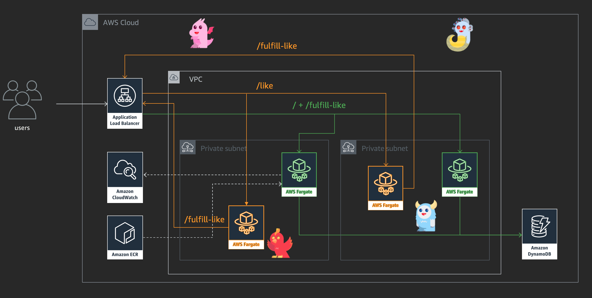

[*^ back to top*](#management-and-operations-with-aws-fargate)

## Lab 1 - Exploring The Task metadata endpoint

In this lab we're going to start investigating the slow response times from our Mythical Mysfits adoption service.

The Amazon ECS container agent provides a method to retrieve various task metadata and Docker stats. This is referred to as the task metadata endpoint. In this lab we're going to implement a mechanism for capturing statistics from the task metadata endpoint. Armed with this information we should be able to get a better understanding how the containers in our task are operating.

More information on Task Metadata endpoint can be found here: https://docs.aws.amazon.com/AmazonECS/latest/developerguide/task-metadata-endpoint-v2.html

### Instructions

#### 1.1 Add new side-car container for exposing task metadata

1. The Amazon ECS container agent uses the local IPv4 address of each container to determine which task metadata is only accessible from within the container. Executing a curl request against the task metadata endpoint from within a running container is the only way to access the metadata for a given task, and the containers running in that task. For example:

    <pre>curl 169.254.170.2/v2/metadata</pre>

    In order to make the task metadata accessible, and ultimately consumable using tools external to the task runtime environment we're going to need to add some additional capabilites to our deployed services. We could do this by modifying the core application running within the task. This is not a very scalable approach however. So, instead of modifying the mythicial misifts service, we will be using the sidecar container approach.

    > Sidecar containers are a common software pattern that has been embraced by engineering organizations. It’s a way to keep server side architecture easier to understand by building with smaller, modular containers that each serve a simple purpose. Just like our Mythical Mysfits application is be powered by multiple microservices, each microservice can also be powered by multiple containers that work together. A sidecar container is simply a way to move part of the core responsibility of a service out into a containerized module that is deployed alongside a core application container.

2. Add the new metadata-proxy side car container to the Mythical Mysfits **Like** service task definition.

    The metadata-proxy side car container image is avaialble from the following Amazon Elastic Container Registry repository:

    <pre>205094881157.dkr.ecr.us-west-2.amazonaws.com/metadata-proxy:latest</pre>

    The metadata-proxy side car will proxy requests to the tasks metadata endpoint over port 8001. When you add the new container to the task definition, be sure to configure the container port to **8001** and the protocol to **TCP**.

    

    **The metadata-proxy is not suitable for producton deployments. It is simple used as part of this workshop to demonstrate one approach to consuming the information provided by the ECS Task Metadata Endpoint**

    <details>
    <summary>Step by Step</summary>

    1. Sign-in to the AWS management console and open the Amazon ECS console at <https://console.aws.amazon.com/ecs/>.

    2. Select **Task Definitions** from the left-hand menu.

    3. Click on the task definition with **Like-Service** in the name.

    4. Check the box next to the latest version of the task definition.

    5. Click **Create new revision**.

    6. Under **Container Definitions** click **Add container**:

        1. In **Container name**, enter **metadata-proxy**.

        2. In **Image**, paste the repository URI and add the latest tag.
            
            <pre>205094881157.dkr.ecr.us-west-2.amazonaws.com/metadata-proxy:latest</pre>

        3. In **Memory Limits (MiB)**, set **Hard Limit** to **128**.

        4. In **Port mappings**, set **Container Port** to **8001** and protocol to **TCP**.

        4. Click **Add**.

    7. Click **Create**.

    </details>

#### 1.2 Update the Mysfits Like Service

1. Now that we've updated the task definition for the Mysfits **Like** service we need to update the exsiting service definition to use the latest version of the task definition, which includes the metadata-proxy sidecar. Go ahead and update the service now to use the latest version of the task definition.

    <details>
    <summary>Step by Step</summary>

    1. Sign-in to the AWS management console and open the Amazon ECS console at <https://console.aws.amazon.com/ecs/>.

    2. Click **Clusters** and then click **Cluster-{StackName}**.

    3. Select the service with **Like-Service** in the name and click **Update**.

    4. In Task Definition select the revision of the **Like** task that you noted in the earlier step.

        1. In Minimum healthy percent enter **50**.

        2. In Maximum healthy percent enter **100**.

    The update to the **Like** service will replace the containers that make up the service. ECS offers you control over how the replacement process works. Because the **Like** containers could be serving production traffic, you should not stop all the containers before starting new ones. By specifying a Minimum health percent of 50 and a Maximum healthy percent of 100, ECS will terminate up to 50 percent of the active **Like** containers, then start new containers. Once the new containers are healthy, ECS will terminate the remaining 50 percent of and replace those.

    This way, the **Like** service does not exceed its current footprint.

    5. Click **Next step** until you reach the end of the wizard, then click **Update service**.

    6. Click **View service**. The Deployments tab should show the **PRIMARY** deployment as well as the **ACTIVE** deployment.

    *Note: You may see a third deployment. This deployment was triggered as part of the stack creation because the CloudFormation template also created a deployment pipeline using AWS CodePipeline. This message is informational, you don't have to do anything additional.*

    7. Click the **Events** tab. Depending on the number of **Like** tasks that were running at the time you updated the service, ECS will show events terminating groups of **Like-Service** tasks, and starting groups of the new revision.

    8. Click the **Tasks** tab. You should see tasks with the Last status of **RUNNING** and the Task Definition of the revision number you noted in the earlier step.

    </details>

#### 1.3 Get the Task IP Address

1. Now that the **Like** service, and its constituent tasks, have been updated to include the **metadata-proxy** container we can query the task metadata from outside of the task runtime environment. In this step you need to find the IPv4 address assigned to one of the **Like-Service** tasks. We will then use this information to manually query the task metadata using a simple curl request.

    <details>
    <summary>Step by Step</summary>

    1. Open the Amazon ECS console at <https://console.aws.amazon.com/ecs/>.

    2. Click **Clusters** and then click **Cluster-{StackName}**.

    3. Click the **Tasks** tab. You should see tasks with the **Last Status** of **RUNNING** and the task definition of the revision number you noted in the earlier step.

    4. Click on the one of those tasks.

    5. On the **Details** tab, under **Network**, make a note of the **Private IP** for the task.

        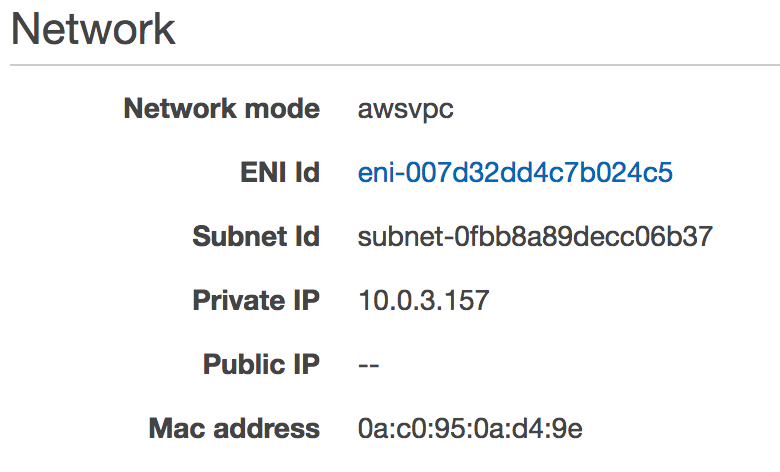

    </details>

#### 1.4 Querying The Task metadata Endpoint

1. Using the **Private IP** you noted in the previous step, query one of the following URLs with the curl command-line utility. The curl command-line utility is pre-installed in the Cloud9 IDE. The response should be in JSON format. Have a look through the response and see if you can find the list of **containers** within your task. ***Remember to replace the IP address, denoted by x.x.x.x in the following examples, with the Private IP you recorded in the earlier step***.

     - http://x.x.x.x:8001/v2/metadata
     - http://x.x.x.x:8001/v2/stats

    **QUESTION** Do you notice anything unusual?

    <details>
    <summary>Learn more: Task Networking</summary>

    The Cloud9 IDE comes has a utility called JQ installed. [JQ](https://stedolan.github.io/jq/) is a lightweight command-line utility for processing JSON.

    Use JQ to explore the list of containers reported by the task metadata. In addition to the **metadata-proxy** container and primary service container, you should also see a third container called ```internal-ecs-pause```.

     ```curl http://x.x.x.x:8001/v2/metadata | jq '.Containers'```

    **What is the pause container?**

    To avoid the race condition between configuring the network stack and commands being invoked in application containers, the ECS agent creates the additional **pause** container for each task before starting the containers in the task definition. It then sets up the network namespace of the **pause** container by executing a chain of CNI plugins. The ECS agent also starts the rest of the containers in the task so that they share the network stack of the **pause** container. This means that all containers in a task are addressable by the IP addresses of the elastic network interface, and they can communicate with each other over the ***localhost*** interface.

    [You can read more about task netwoking here.](https://aws.amazon.com/blogs/compute/under-the-hood-task-networking-for-amazon-ecs/)
    </details>

    <details>
    <summary>Step-by-Step</summary>

    1. Open the AWS Cloud9 console at <https://console.aws.amazon.com/cloud9/>.

    2. Locate the Cloud9 environment created for the workshop.  The name should be `Project`-***STACK_NAME***.

    3. Click the **Open IDE** button.

    4. At the command prompt in the Cloud9 IDE, run the following commands to query the task metadata for each of the tasks you have deployed.

        1. The first endpoint returns metadata JSON for the task, including a list of the container IDs and names for all of the containers associated with the task. ***Remember to replace the IP address with the Private IP you recorded in the earlier step***.

            ```curl x.x.x.x:8001/v2/metadata | jq```

        2. The second endpoint returns metadata JSON for the specified Docker container ID.

            ```curl x.x.x.x:8001/v2/metadata/<container-id> | jq```

        3. The third endpoint returns Docker stats JSON for all of the containers associated with the task. 

        ```curl x.x.x.x:8001/v2/stats | jq```

        4. The fourth and final endpoint returns Docker stats JSON for the specified Docker container ID.

            ```curl x.x.x.x:8001/v2/stats/<container-id> | jq```

    </details>

#### 1.5 Visualising Task and Service Metrics with CloudWatch Dashboards 

1. Now that we have a mechanism to access the task metadata and a rich set of statistics about the containers running in our tasks, let's explore how we can visualise other data exposed by Amazon ECS using [CloudWatch Dashboards](https://docs.aws.amazon.com/AmazonCloudWatch/latest/monitoring/CloudWatch_Dashboards.html).

    <details>
    <summary>Step by Step</summary>

    1. In the AWS Console, under **Management Tools** click **CloudWatch**.

    2. Click **Dashboards** then click **Create Dashboard**.

    3. Enter a name for your dashboard, for example **Mysfits-Dashboard** and then click **Create Dashboard**.

    4. Select the **Number** widget to add to your dashboard by clicking on it and then click **Configure**.

    5. On the **All metrics** tab, click **ECS**, then **Cluster Name, Service Name**.

    6. Find the services where the name containers **Mythical-Monolith-Service** and select the **CPUUtilization** metric.

    7. On the **Graphed metrics** tab, for the **CPUUtilization** metric change the **Statistic** to **Sample Count**, and the period to **1 Minute**.

    8. Change the widget title from **Untitled Graph** to **Mythical-Monolith-Service-Task-Count** by clicking on the small pencil icon.

    9. Click **Create Widget**.

        This widget now shows you the running number of tasks for the **Mythical-Monolith-Service** service.

    10. Click **Add widget** again to add a second widget to your dashboard.

    11. Select the **Line** widget to add to your dashboard by clicking on it and then click **Configure**.

    12. On the **All metrics** tab, click **ECS**, then **Cluster Name, Service Name**.

    13. Find the services with name **Mythical-Monolith-Service** and **Mythical-Like-Service** and select (check the box) the **CPUUtilization** metric for both.

    14. On the **Graphed metrics** tab, for the **CPUUtilization** metric set the **Statistic** to **Average**, and the **Period to 1 Minute**.

        Change the widget title from **Untitled Graph** to **Service-CPU-Usage** by clicking on the small pencil icon.

    15. Click **Create Widget**.

    16. Click **Save Dashboard**.

    This widget now shows you the running number of tasks for the average CPU usage for the **Mythical-Monolith-Service** and the **Mythical-Like-Service** service.
    </details>

    Repeat the above steps for the and create additional widgets so show the **Mythical-Like-Service-Task-Count** and **Service-Memory-Usage**.

    Why not try and increase the number of tasks in the **Mythical-Monolith-Service** so that we can see if our newly created CloudWatch Dasboard updates to reflect the changes.

    <details>
    <summary>Step by Step</summary>

    1. Open the Amazon ECS console at <https://console.aws.amazon.com/ecs/>.

    2. Click **Clusters** and then click **Cluster-{StackName}**.

    3. Select the service with **Monolith-Service** in the name and click **Update**.

    4. In **Number of tasks** set the number of tasks to 2 more than the current value.

    5. Click **Next step** until you reach the end of the wizard, then click **Update service**.

    6. Click **View service**. The Deployments tab should show the **PRIMARY** deployment as well as the **ACTIVE** deployment.

    7. Click the **Tasks** tab. You should see the same number of running tasks as you previously specified.

    8. In the AWS Console, under **Management Tools** click **CloudWatch**.

    9. Click **Dashboards** then click on the dashboard you created earlier.

    10. After a moment or two, you should see **Mythical-Monolith-Service-Task-Count** update to reflect the number of running tasks.

    </details>

### Checkpoint:
Congratulations. You now know how to use the Task Metadata Endpoint to query envrionmental and runtime statistics about your tasks. You've also started to build out a CloudWatch Dashboard based on metrics provided by Amazon ECS which can be used to visualise important information regarding the health of your environment.

In the next lab, you will explore how using log information, which can be extremely useful when diagnosing problems with applications and services.

[*^ back to top*](#management-and-operations-with-aws-fargate)

## Lab 2 - Log Analysis with CloudWatch Logs and Elasticsearch

After investigating CloudWatch ECS metrics and Docker stats from the ECS task metadata endpoint, you've determined there's unusual resource consumption occuring in the Likes microservice.  Let's dig into the application logs to see if there are any hints as to what might be causing the unusual behavior.  

Application logs are already being sent to CloudWatch Logs using the awslogs driver, so there's already a good story around log aggregation.  In this lab, you'll first explore the Mythical Mysfits web application which uses the **Like** microservice to understand what's the reported unusual behavior.  Then you'll dig into the log streams in CloudWatch Logs to better understand the application logs.  

In reality, there may multiple instances of the microservice, so multiple log streams to investigate.  Plus if the problem is not specifically isolated to a single microservice, you may need to parse through logs of multiple microservices.  We need a way to search through the copious logs being collected.

CloudWatch Logs has a feature called subscriptions which provides access to a real-time feed of log events.  You'll use this feature to stream log events to an Elasticsearch cluster and use Kibana to interactively explore the logs.  Lambda is the mechanism that will transform incoming CloudWatch Logs data to index documents and submit them to the Elasticsearch cluster.

### Instructions

#### 2.1 Review the Mythical Mysfits site to understand the reported unusual behavior.

1. First you need to generate some logs, so browsing the application will help with this.  Open the `S3WebsiteEndpoint` URL, which you'll find in your CloudFormation outputs.  

    Click like (i.e. the heart icon at the bottom right of each creature profile) for a couple of the mythical creatures, and notice how the likes functionality works sometimes or sometimes slowly or not at all.  Something is definitely not right.

#### 2.2 Review Like microservice logs in the CloudWatch Logs dashboard.

1. Navigate to the [CloudWatch Logs dashboard](https://console.aws.amazon.com/cloudwatch/home#logs:) and find the log group for the **Like** microservice.  The log group name should follow the convention <code><b><i>STACK_NAME</i></b>-MythicalLikeLogGroup-xxx</code>.  

    If your account has many log groups, enter your stack name in the filter search bar to reduce the results.  See following screenshot as an example; in this case, the stack name is `mmtest`.

    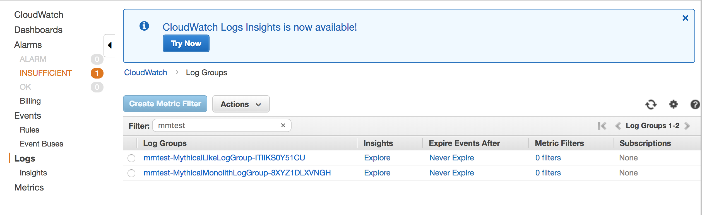

    Once you find the log group, right-click and open it in a new browser tab.  In that new tab, click on the latest log stream for a cursory review of what the application logs look like and how it's presented by CloudWatch Logs.  
    
    First thing you'll notice is the endless stream of GET requests.  Those are ALB health checks.  Likes are in the form of POST messages, so go ahead and filter on the POST HTTP method, but typing `POST` in the "Filter events" field.

    Note down any interesting findings and close the tab when you're done.  This exercise is fine for reviewing logs in basic, small environments, but we need an easier way to search through logs coming from potentially many microservices or multiple instances of a particular microservice.  Remember that each instance of a task will have its own log stream.

#### 2.3 Configure a CloudWatch Logs subscription to stream log data from the Like microservice to Amazon Elasticsearch (ES).

*Note: For your convenience, the workshop CFN template created an Elasticsearch (ES) domain for you to use as a target to stream your logs.*

1. In the [CloudWatch Logs dashboard](https://console.aws.amazon.com/cloudwatch/home#logs:), click on the radio button next to the Like microservice log group to select it, click on the **Actions** dropdown menu, and choose **Stream to Amazon Elasticsearch Service**.

    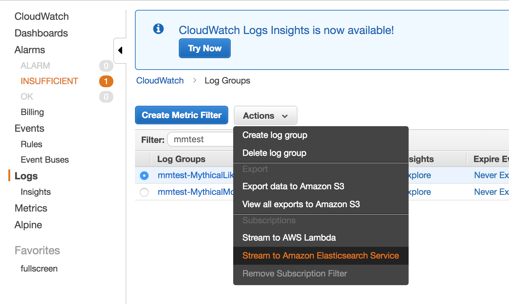

    Configure the following fields:
    - **Select account** - select **This account**
    - **Amazon ES Cluster** - select the ES cluster provisioned by CFN from the dropdown menu; this is the `DOMAINNAME` parameter you entered when you ran the template
    - **Lambda IAM Execution Role** - select the IAM role provisioned by CFN from the dropdown menu; the format will be <code><b><i>STACK_NAME</i></b>-LoggingMasterRole-xxx</code>

    *Note: Anytime you see ***STACK_NAME***, that is the stack name parameter from the CFN template.*

    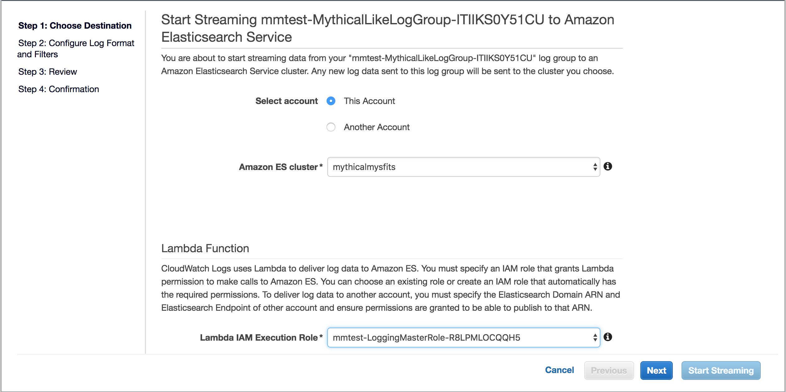

    Click **Next**

2. For **Log Format**, select **Other** from the dropdown menu.  Leave the "Subscription Filter Pattern" field blank.  

    *Tip: if you wanted to only send certain log entries to be indexed, you could define a filter pattern here, and you can select an existing log stream or provide custom log data to test your filter pattern.*

    Click **Next**

3. Review your settings and click **Next**

    You should see a "Success" page.  Note down the name of the Lambda function created for indexing log events to ES, so you can delete the function during workshop cleanup.  

    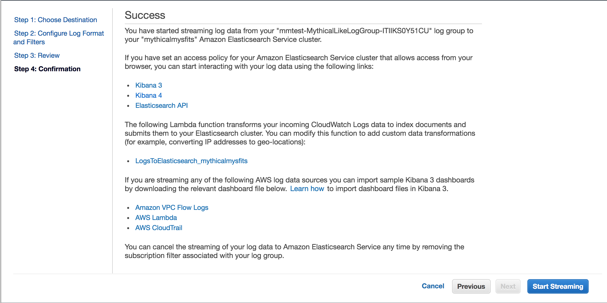

4. Click **Start Streaming** to complete the subscription creation.  

    You should be back at the CloudWatch Logs dashboard.  If you look up the **Likes** log group again, you'll see the new subscription defined.

    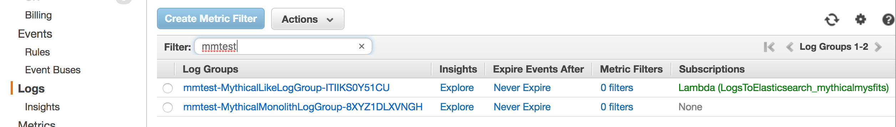

    Success, you're now streaming logs to Elasticsearch.  Now you'll configure Kibana, so you have an interactive UI for digging through the logs.

#### 2.4 Enable Cognito authentication for Kibana.

<details>
<summary>Learn more: Kibana Cognito Authentication</summary>

When an ES domain is created, it comes configured with Kibana.  Unlike the ES endpoint, Kibana doesn't natively support IAM.  You can set up an IP access policy, or for more granular access control, you can have username/password login by configuring Cognito authentication.  

This feature can be enabled for an existing ES cluster and uses [Cognito user pools](https://docs.aws.amazon.com/cognito/latest/developerguide/cognito-user-identity-pools.html) for user management and user sign-in.  Here's more information about how this works - <a href="https://docs.aws.amazon.com/elasticsearch-service/latest/developerguide/es-cognito-auth.html">Amazon Cognito Authentication for Kibana</a>

The CFN template you ran earlier set up the Cognito user pool, identity pools and necessary IAM roles.
</details>

1. When signing into Kibana with Cognito authentication, you're redirected to a sign-in page hosted by Cognito user pools.  That page needs a unique domain name assigned to it.

    To set that up, navigate to the [Cognito dashboard](https://console.aws.amazon.com/cognito/home).  Click **Manage User Pools**, and click on the workshop user pool, which will follow the format <code><b><i>STACK_NAME</i></b>_kibana_access</code>

2. Under "App Integration" in the left menu, click **Domain Name**.  
    
    Enter a unique domain name and click **Save changes**.  As you can see, you can even enable a custom domain, but for now just set a value for the Amazon Cognito domain.  This can be any string.  Use the **Check availability** button to check it's an available name.

    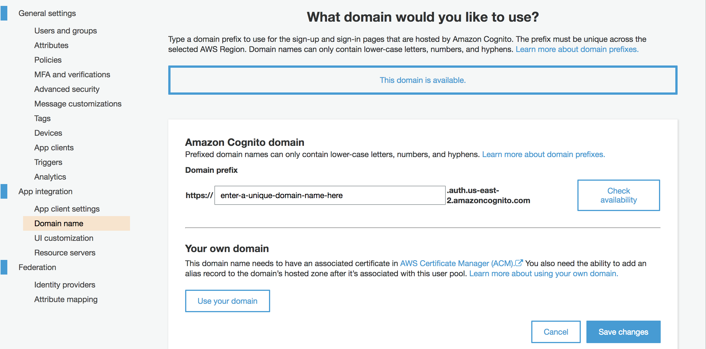

3. Now you're ready to modify your ES cluster to enable Cognito authentication for Kibana.

    Navigate to the [Elasticsearch Service dashboard](https://console.aws.amazon.com/es/home).  Click on the workshop ES domain.

    Click **Configure cluster**.  Scroll down to "Kibana Authentication", and click the checkbox next to "Enable Amazon Cognito for authentication".

    Select the workshop Cognito user pool and identity pool.  Both will have `mythicalmysfits` in the name.

    Your settings should look similar to below, but not exactly; e.g. your region, user pool, identity pool may be unique.

    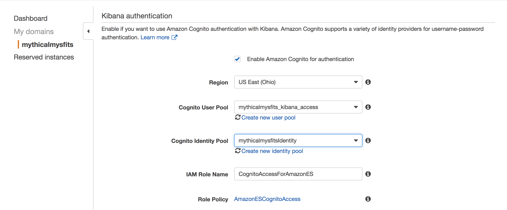

    Click **Submit**

    Your ES domain will enter into a "Processing" state while performing the update.  This change will take about 5-10 minutes to complete.

4. While you wait, you can grab your temporary password to login.  When you ran the workshop CFN template earlier, you provided an email address for a parameter called `Cognito Admin email address`.  Cognito used this to create a user in the user pool and emailed you temporary credentials.  Login to that email address to find and note down your temporary password.

#### 2.5 Login to Kibana, and create an index pattern.

1. Once the domain status returns to "Active", click on the **Kibana** URL shown in the Overview tab which will open a new tab and present you with a login.  

    Enter your email address as your username and the temporary password you looked up in the last step.  When logging in for the first time, you'll be prompted to change your password.

2. Once logged in, click on **Discover** in the left menu.  You'll be prompted to create an index pattern so Elasticsearch knows which index you want to explore.

    Enter `cwl*` in the "Index Pattern" field since log files from CloudWatch Logs uses this as a prefix.

    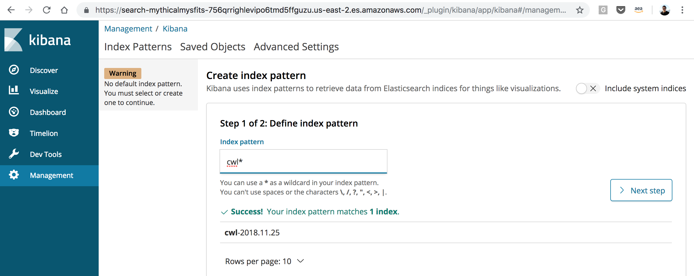

    Click **Next step**

    Select **@timestamp** from the drop down menu to apply a time filter for sorting log entries.

    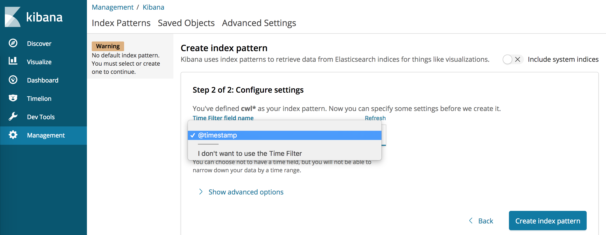

    Click **Create index pattern**

    With the index pattern created, you can see the fields that Elasticsearch indexed from CloudWatch log files.  

3. Click on **Discover** in the left menu to start exploring the logs.

    Explore the logs using Kibana, and identify the source of the unusual load.

    <details>
    <summary>Hint: New to Elasticsearch?</summary>
    If you're 100% new to Elasticsearch, try scrolling through the log entries to see if anything stands out.  Though you'll quickly realize that ALB health checks pepper the log stream with GET requests.  

    Elasticsearch is based on lucene, so there is structured query syntax you can use, but the easiest thing to do is simply enter text strings in the search bar for a free text search, e.g. !GET will filter out GET messages.  Continue reading as there are more hints below.
    </details>

    Find any interesting in the log entries?

    The team also informed us that they improved logging with proper log levels, which is what you see in the log stream.  Nothing really looks out of the ordinary, but maybe the log level is not granular enough.  They said something about an environment variable controlling the log level.

    Try to figure out how to set the log level to something more granular, like `DEBUG`.

    <details>
    <summary>HINT 1</summary>

    Environment variables for Fargate tasks can be set in the task definition.  

    Navigate to [Task Definitions](https://console.aws.amazon.com/ecs/home#/taskDefinitions) in the ECS dashboard.  

    Find the latest **Likes** microservice task definition.  
    
    Click **Create a new revision**, scroll down to "Container Definitions", and click on the container named `Like-service`.

    Scroll down to the "ENVIRONMENT" section and find the "Environment variables" section where you'll see an environment variable key called `LOGLEVEL` with a value of `ERROR`.  Enter `DEBUG` to be the new value.

    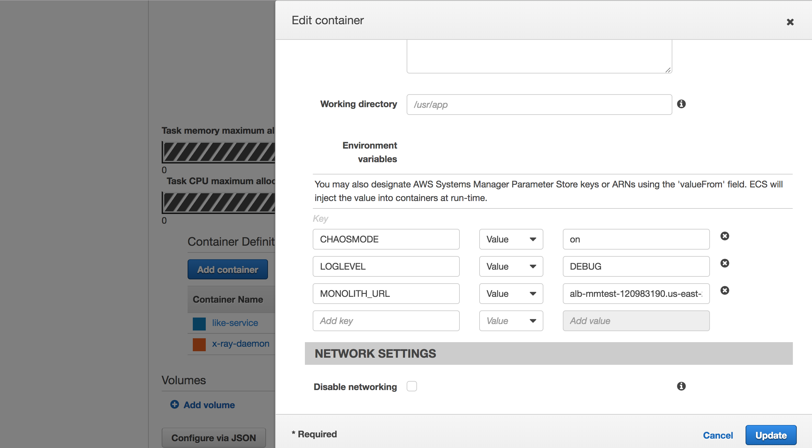

    You may also notice an environment variable `CHAOSMODE`, that's another hint.  Leave that as `on` for now.

    Click **Update** to save the change to the container definition.

    Click **Create** to create the new revision of the task definition.  

    Navigate to your workshop ECS cluster, find the Likes service (i.e. <code><b><i>STACK_NAME</i></b>_Mythical-Like-Service</code>).  Select the service and click **Update**.

    Select the latest revision of the task definition that you just created, and click the checkbox for **Force new deployment**.  

    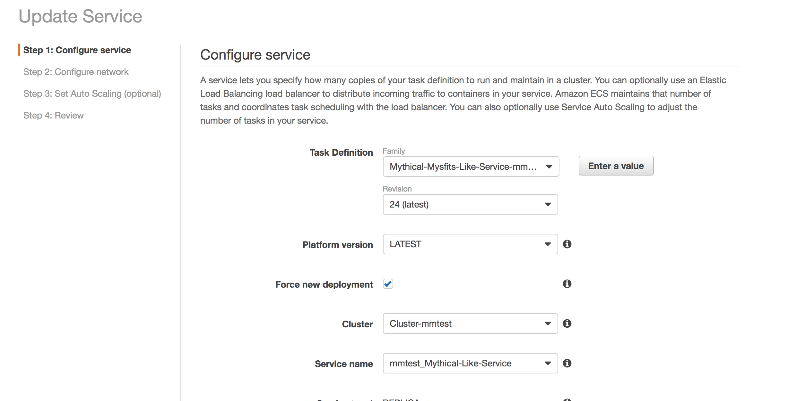

    Click **Next step** through the remaining steps without any additional modifications and click **Update Service**.

    Wait for the service update to complete the deployment; you can watch progress on the deployments tab.  

    Open the S3 site again and click a few likes to generate some more logs.  Review the new log entries in Kibana/Elasticsearch.

    Do you see new log message that reveal the problems with the app?  If not, reveal HINT 2 below.
    </details>

    <details>
    <summary>HINT 2</summary>

    Search for 'WARN:' in the search bar to pinpoint the root of the unusual behavior.
    </details>

### Checkpoint

Congratulations!!!  You've successfully implemented log streaming to Elasticsearch enabling you to search through logs using Kibana as the UI.  You updated the log levels for more granular logging and discovered that the source of the unusual load on the system is due to an artificial load and random 404 generator both enabled from the latest task definition environment variables.

This lab is an adaptation of a centralized logging pattern provided by the AWS Solutions Builder Team.  Further reading - [Centralized Logging Solution](https://aws.amazon.com/answers/logging/centralized-logging/)

*Note: Amazon released a [CloudWatch Logs Insights](https://aws.amazon.com/blogs/aws/new-amazon-cloudwatch-logs-insights-fast-interactive-log-analytics/) feature during re:Invent 2018, so if you have time, explore this as another way to parse through logs.*

[*^ back to top*](#management-and-operations-with-aws-fargate)

## Lab 3 - Distributed Tracing and Debugging with AWS X-Ray

You've peeled back more layers of the onion by looking at ECS service metrics, container metrics, and application logs.  From this, you've discovered the source of the unusual load used to stress the **Like** microservice and used a few different tools to troubleshoot.  The Mythical Mysfits environment is simple today, but our development roadmap aims to introduce more microservices by mid-year.  The tools explored in earlier labs are effective, but what if there is a way to get a top down service map of our microservices to understand how they are performing?  

Distributed Tracing is a way to profile a request as it touches multiple microservices or other systems like databases.  Trace data helps developers identify bottlenecks and deeply inspect requests, so they know where to focus their efforts.  

AWS X-Ray is a distributed tracing service that provides an SDK for instrumentation of your application, a daemon for aggregation and delivery of trace data, and a dashboard to view a service map with trace statistics and HTTP status codes.

In this lab, you'll implement X-Ray for the Like microservice and compare its findings to what you've already discovered throughout the workshop.

### Instructions

#### 3.1 Add the X-Ray daemon to be a sidecar container in the Like service task definition.

The AWS X-Ray daemon is an open software application that listens for traffic on UDP port 2000, gathers raw segment data, and relays it to the AWS X-Ray API.  When deployed with Fargate, the Task IAM role authorizes it to communicate with the X-Ray API.  The workshop CFN template you ran earlier create a role that has the necessary permissions.

Further reading: [X-Ray daemon permissions documentation]("https://docs.aws.amazon.com/xray/latest/devguide/xray-daemon.html#xray-daemon-permissions)
    
The setup script earlier built and pushed a Docker image that runs the X-Ray daemon to ECR.  If you're curious about the open source project and would like to review the Dockefile behind the image, expand below.  

<details>
<summary>Learn more: X-Ray daemon github repo and Dockerfile</summary>

GitHub repository - https://github.com/aws/aws-xray-daemon 

Dockerfile -

<pre>
# Copyright 2017 Amazon.com, Inc. or its affiliates. All Rights Reserved.
#
# Licensed under the Apache License, Version 2.0 (the "License").
# You may not use this file except in compliance with the License.
# A copy of the License is located at
#
# http://www.apache.org/licenses/LICENSE-2.0
#
# or in the "license" file accompanying this file. This file is distributed
# on an "AS IS" BASIS, WITHOUT WARRANTIES OR CONDITIONS OF ANY KIND, either
# express or implied. See the License for the specific language governing
# permissions and limitations under the License.

FROM amazonlinux:1

# Download latest 2.x release of X-Ray daemon
# Unpack archive, by default unzip is not installed so do that beforehand
RUN yum install -y unzip && \
    cd /tmp/ && \
    curl https://s3.dualstack.us-east-2.amazonaws.com/aws-xray-assets.us-east-2/xray-daemon/aws-xray-daemon-linux-2.x.zip > aws-xray-daemon-linux-2.x.zip && \
    unzip aws-xray-daemon-linux-2.x.zip && \
    cp xray /usr/bin/xray && \
    rm aws-xray-daemon-linux-2.x.zip && \
    rm cfg.yaml

# Expose port 2000 on udp
EXPOSE 2000/udp

ENTRYPOINT ["/usr/bin/xray", "-b", "0.0.0.0:2000"]

# No cmd line parameters, use default configuration
CMD ['']
</pre>
</details>

1. Since you have a working X-Ray Docker image, update the **Like** microservice task definition to add it as a sidecar.

    <details>
    <summary>Learn more: ECS Task Definition</summary>

    A task definition is a JSON template that instructs ECS how to launch your container(s).  It has attributes that define things like what container(s) to run, what resources are needed, what ports to expose, and more.  If you're familiar with Docker run arguments, you'll find there are parallels.  Further reading - <a href="https://docs.aws.amazon.com/AmazonECS/latest/developerguide/task_definitions.html">ECS Documentation: Task Definitions</a>
    </details>

    Navigate to [Task Definitions](https://console.aws.amazon.com/ecs/home#/taskDefinitions) in the ECS dashboard.  

    Find the Like microservice task definition in the list; the naming format will be <code>Mythical-Mysfits-Like-Service-<b><i>STACK_NAME</i></b></code>.  

    Select the checkbox next to the task definition, and click **Create new revision**.

    Scroll down to "Container Definitions" and click **Add container**.

    Complete the following fields:
    - **Container name** - enter `x-ray-daemon`
    - **Image** - enter ***X-RAY_ECR_REPO_URI***`:latest`; this is the `XrayEcrRepo` value from your CloudFormation outputs, e.g. 123456789012.dkr.ecr.us-east-2.amazonaws.com/mmtest-xray-1s8vu050agmv5:latest
    - **Port mappings** - enter `2000` for container port and select `udp` for protocol

    Your configuration will look similar to this:
    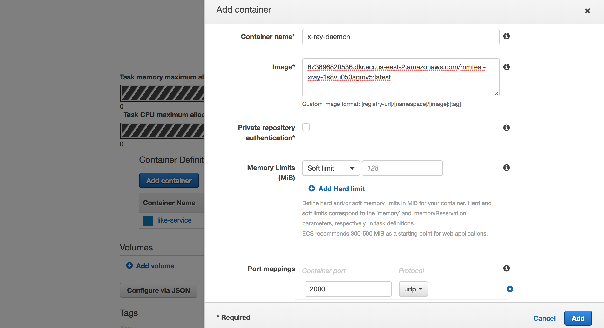

    Click **Add**

    Click **Create**

#### 3.2 Update the Like ECS service to use your updated task definition to also launch the X-Ray daemon sidecar.

<details>
<summary>Learn more: ECS service</summary>

An ECS service maintains a desired number of running ECS tasks.  This is ideal for long running processes like web servers.  Further reading - <a href="https://docs.aws.amazon.com/AmazonECS/latest/developerguide/ecs_services.html">ECS Documentation: Services</a>
</details>

1. Navigate to [Clusters](https://console.aws.amazon.com/ecs/home#/clusters) in the ECS dashboard.  

    Click on your workshop ECS cluster which will have a format of `Cluster`-***STACK_NAME***.  

    Check the checkbox next to the **Like** service and click **Update**.

    Configure the following fields:
    - **Task Definition** - for revision, select the latest
    - **Force new deployment** - check this box

    Your configuration will look similar to this:
    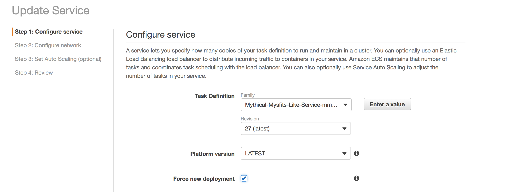

    Click **Next step** and continue doing so until you reach the review page, then click **Update Service**

    Click **View Service** and you should see the deployment begin.  You can move on to start instrumentating the app while the deployment completes.

#### 3.3 First you need to add the X-Ray SDK as a dependency in the Like Docker image, so you can use it in the application code.  You'll use your Cloud9 IDE to do this.

1. Go to your [Cloud9](https://docs.aws.amazon.com/cloud9/latest/user-guide/welcome.html) IDE.  If you don't have that tab still open, navigate to the [Cloud9 dashboard](https://console.aws.amazon.com/cloud9/home) and click **Open IDE** for the workshop Cloud9 IDE.  The name of the environment will have the format `Project`-***STACK_NAME***.

    The setup script you ran earlier cloned the like and monolith application code to your Cloud9 IDE, which you can see in the directory tree on the left side of the IDE.  The code is stored in [AWS CodeCommit](https://docs.aws.amazon.com/codecommit/latest/userguide/welcome.html), a managed source control service.

    The Like service is a Flask application which is based on Python.  There is a [pip install](https://pip.pypa.io/en/stable/reference/pip_install/#requirement-specifiers) command in the Dockerfile that will install python packages listed in the requirements.txt file.  

2. Expand the Like service folder in the directory tree where you'll see **requirements.txt**.  

    Double-click on the file to open it in the editor, and add `aws-xray-sdk` to the list of dependencies, and save the file. (File->Save or Command-s on Mac or Ctrl-s on Windows).

    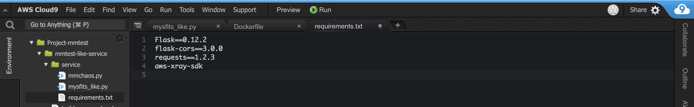

    Now you're ready to start instrumenting the **Like** service application source code.

#### 3.4 Instrument the app to enable tracing for incoming requests to the Like service.

The X-Ray SDK for Python includes middleware that traces incoming requests for Flask (and Django) frameworks.

<details>
<summary>Learn more: What if I'm not using Flask or Django?</summary>

If you're framework is still based on python, you can <a href="https://docs.aws.amazon.com/xray/latest/devguide/xray-sdk-python-middleware.html#xray-sdk-python-middleware-manual">manually create segments</a> using the SDK.  There are also X-Ray SDKs for other programming languages like Java, Go, Node.js, Ruby, .NET.
</details>

The Mythical Mysfits dev team started looking into this, but got dragged into other priorities.  We need your help to pick up where they left off and add the required lines of code to load and activate the the middleware using your Cloud9 IDE.

1. In your Cloud9 IDE, double-click on **mysfits_like.py** in the directory tree to open the file in the editor.  Review the **Like** app code; it appears the dev team left some helpful comments to guide you along (look for `# [TODO]` comments).  Read those comments and add in the missing lines of code.

    The [X-Ray SDK for Python Middleware Documentation](
    https://docs.aws.amazon.com/xray/latest/devguide/xray-sdk-python-middleware.html#xray-sdk-python-adding-middleware-flask) is also a helpful resource to understand what's needed to load and use the middleware.

    Once you're done adding the missing lines, save the file, and expand the hint below to review your work.  If you're unsure of what to do or running out of time, you can use the hint as a reference to make the necessary additions to move on.

    <details>
    <summary>HINT: mysfits_like.py code with X-Ray middleware added.</summary>

    Here is a screenshot of what the instrumented Like service code should look like:
    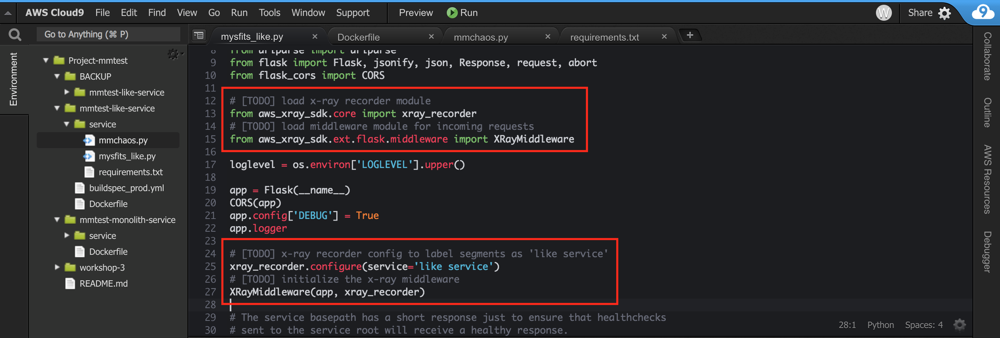

    For COPY/PASTE convenience, here are the two sections you see in the screenshot above:
    
    <pre>
    # [TODO] load x-ray recorder module
    from aws_xray_sdk.core import xray_recorder
    # [TODO] load middleware module for incoming requests
    from aws_xray_sdk.ext.flask.middleware import XRayMiddleware</pre>

    And

    <pre>
    # [TODO] x-ray recorder config to label segments as 'like service'
    xray_recorder.configure(service='like service')
    # [TODO] initialize the x-ray middleware
    XRayMiddleware(app, xray_recorder)
    </pre>

    </code>
    </details>

#### 3.5 Commit the change to Code Commit to kick off an automated deployment of your updated application code and container image requirements.

As the dev team continues down the road of microservices, they're using [AWS CodePipeline](https://docs.aws.amazon.com/codepipeline/latest/userguide/welcome.html) for continuous deployments to be more agile.  The pipeline they have set up watches for changes to the **Like** service source code master branch in AWS CodeCommit.

1. Using Cloud9, commit and push your updated Like application code and requirements file to the master branch to kick off the pipeline.  

    If you're not familiar with git commands, expand the hint below for step by step.

    <details>
    <summary>HINT: Git commands step by step</summary>

    Check that the like service code was modified.
    ```
    $ git status
    ```
    Add file to staging.
    ```
    $ git add service/
    ```
    Commit the file to your local repository.
    ```
    $ git commit -m "instrumented like service with xray"
    ```
    Push the commit to CodeCommit (remote repository)
    ```
    $ git push origin master
    ```

    The commands and output should look similar to this:
    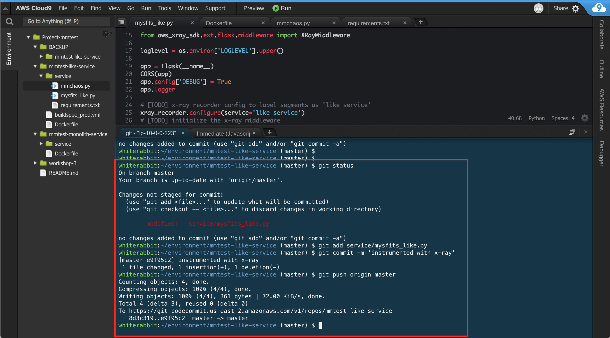
    </details>

    Once your code is pushed to CodeCommit, CodePipeline kicks off a build pipeline, which will pass your application files to CodeBuild.  
    
    You'll notice there's a file called **buildspec_prod.yml** in your Cloud9 directory tree.  That is the instruction set that CodeBuild uses to run the build.  
    
    Once the image artifact is created, it's pushed to ECR and then deployed by ECS/Fargate using CodeDeploy.  This whole process will take a few minutes, and you can monitor the progress in the CodePipeline dashboard.
    
2. Monitor the deployment to make sure all stages are successful.

    Navigate to the [CodeSuite dashboard](https://console.aws.amazon.com/codesuite).

    Expand the **Pipeline CodePipeline** section in the left menu.  
    
    Click on **Pipelines**, and click on the workshop pipeline which should named the same as your ***STACK_NAME***.  

    Once all stages of the pipeline are marked green, ending with the deploy stage, that means the updated container was successfully built and deployed.

    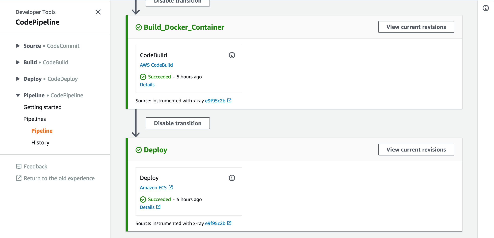

#### 3.6 Generate some trace data.

1. Now that the Like service is instrumented, inbound requests will generate trace data.  Open the Mythical Mysfits site in a new tab.  This is the **S3WebsiteEndpoint** URL listed in your CloudFormation outputs.  

2. Click the heart icon on a few (recommended 7-9 clicks) mythical creatures to generate some requests to the like service.  

    If you open the Javascript console in your browser (e.g. in Chrome, you can find this in View->Developer->Javascript Console), you will see the requests coming in and exhibit one of three possible results - an immediate response (rare), a delayed response, or no response (i.e. a 404 HTTP code.

    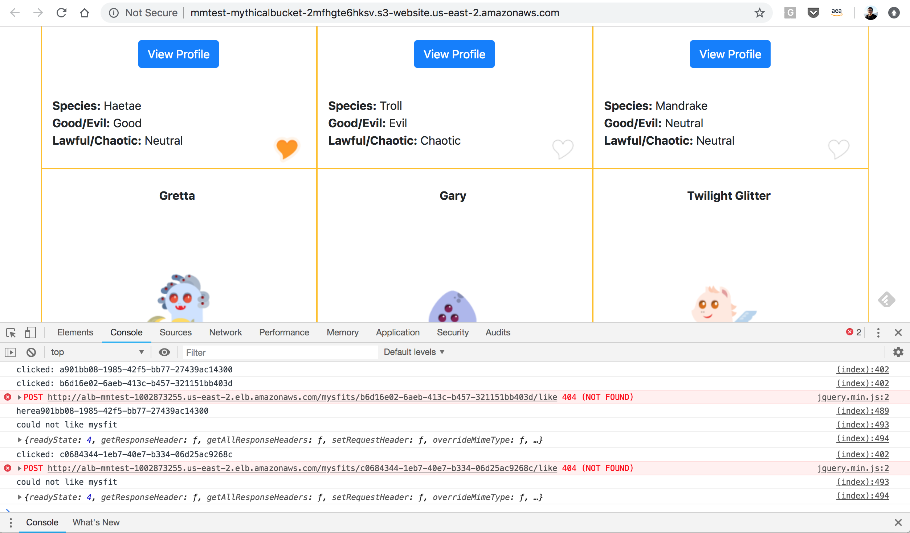

#### 3.7 Review the results in the X-Ray console.

1. Navigate to the [X-Ray dashboard](https://console.aws.amazon.com/xray/home) and you'll see the Service map which shows clients hitting the **Like** service.

    On the surface, it appears everything is fine.  The Like service shows green which means it's returning 200 OK.  And average response time is in the milliseconds.  Something doesn't add up.  

2. Explore the dashboard a little deeper and see if you can find anything interesting that matches up to your findings from earlier labs.  

    Expand the hint below for detailed steps to isolate the interesting traffic.

    <details>
    <summary>HINT: Detailed steps to find key insights</summary>

    A good place to start is to look at the traces that X-Ray has collected.  Click on **Traces** from the left menu.  

    X-Ray by default will show the `Last 5 minutes` of trace data.  Choose a longer time range like `Last 30 minutes` from the drop down in the upper right hand corner of the window, so we have more traces to review.  

    Notice an abundance of GET requests in the Trace list.  These are the ALB health checks mentioned earlier.  These are throwing off the statistics since the response time of those are in the milliseconds.  If you click on one of the GET request traces and select the **Raw data** tab, you'll see that the useragent is `ELB-HealthChecker/2.0`.  

    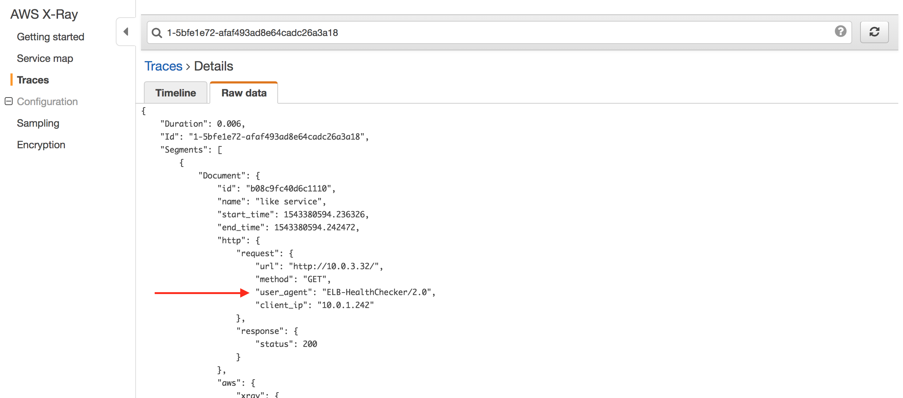

    Apply a filter expression to ignore those and look specifically for - POST messages, error codes, or lengthy response times.

    Go back to the main **Traces** page by clicking on the link from the left menu.  

    Enter `service("like service") { responsetime > 1 OR error } AND http.method = "POST"` into the search bar to apply that filter.

    Earlier when you instrumented the app, you labeled your service as `like service`.  

    The statements in the `{}` filter on `response time` and `error` which maps to a `404` response code.

    And lastly we're only looking at traces for `POST` messages.

    If you want to retain this view for other users, you can create a filter expression group by selecting **Create group** in the drop down menu to the left of the search bar.

    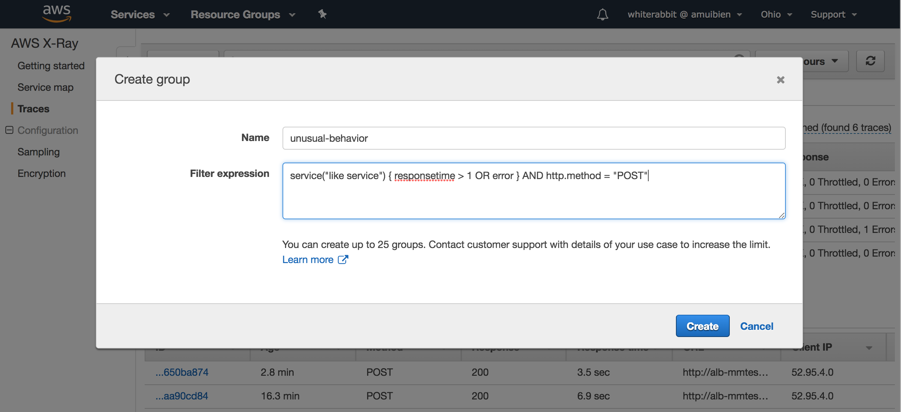

    Check out [X-Ray filter expression documentation](https://docs.aws.amazon.com/xray/latest/devguide/xray-console-filters.html#console-filters-syntax) for other expressions to experiment with.

    And finally, click on **Service Map** from the left menu.  You may have to reset the time range to be something longer, but notice with the filter expression applied, the service is showing stats that match up with the strange behavior, e.g. slower avg response time, and if your traces captured any 404 response codes, the colored ring around the like service will show the ratio of 404s (orange) to valid 200s (green).

    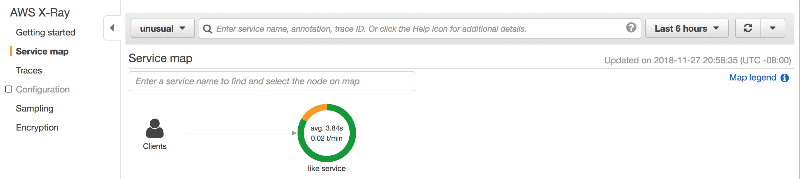
    </details>

### Checkpoint
Congratulations!!!  You've successfully implemented X-Ray to trace inbound requests to the Like microservice and discovered valuable information and statistics.

Bonus Activity: There is one more lab to go in this workshop, so only do this if you complete Lab 4 and have extra time.  Try to setup tracing for downstream requests from the Like service to the monolith.  The dev team used the strangler application pattern to implement the Like microservice, which means there is still an integration hook back to the monolith service.

[*^ back to top*](#management-and-operations-with-aws-fargate)

## Lab 4 - Implementing Task Auto-Scaling

In this Lab you will set up **Task Auto Scaling** for the Mythical Mysfits **Like** service. As an additional step, you may also want to configure **Task Auto Scaling** for the monolith service.

Once you've configured **Task Auto Scaling** you will then setup a [CloudWatch Dashboard](https://docs.aws.amazon.com/AmazonCloudWatch/latest/monitoring/CloudWatch_Dashboards.html) to visualise a number of key metrics that can be used to quickly asses the health of the environment.

### Instructions:

#### 4.1 Set up Task Auto Scaling for the Mythical Mysfits services

1. In this task you will setup task scaling for the **Like-Service** using some pre-configured CloudWatch alarms which are triggered when requests to the ALB hit a certain level.

<details>
<summary>Step by Step</summary>

1. In the **Compute** section click **EC2 Container Service**.

2. In the ECS console click **Cluster-{StackName}** then the service with **Like-Service** in the name.

3. Click the **Update** button at the top right of the console.

4. On the **Configure Service** page click **Next Step**.

5. On the **Network configuration** page click **Next Step**.

6. On the Auto Scaling page select **Configure Service Auto Scaling to adjust your service’s desired count**.

    1. Set **Minimum number** of tasks to 2.

    2. Set **Desired number** of tasks to 2.

    3. Set **Maximum number** of tasks to 100.

7. In **IAM role for Service Auto Scaling** select the role with **ECSAutoScaleRole** in the name.

8. Click **Add scaling policy** button. Select **Step scaling** radio button for **Scaling policy type**

9. In **Policy name** enter **LikeScaleUpPolicy**.

10. In **Execute policy when** select **Use an existing alarm** and choose the alarm with **LikeScaleUpAlarm** in the name.

11. In **Scaling action** click the **Add** button twice.

    1. Enter: **Add 10 tasks** when **1000** <= RequestCount < **2000**

    2. Enter: **Add 20 tasks** when **2000** <= RequestCount < **4000**

    3. Enter: **Add 25 tasks** when **4000** <= RequestCount < +infinity

12. Click **Save**.

13. Click **Add scaling policy** button. Select **Step scaling** radio button for **Scaling policy type**

14. In **Policy name** enter **LikeScaleDownPolicy**.

15. In **Execute policy when** select **Use an existing alarm** and choose the alarm with **LikeScaleDownAlarm** in the name.

16. In **Scaling action** click the **Add** button.

    1. Enter: **Remove 10 tasks** when **1000** >= RequestCount > **100**

    2. Enter: **Remove 5 tasks** when **100** >= RequestCount > -infinity

17. Click **Save**.

18. Click **Next step**.

19. Click **Update Service**.

20. Click **View Service**, then click the cluster name **Cluster-{StackName}**.

</details>

#### 4.2 Generate load to test the scaling policy

1. In this task, you will generate load to cause the Mythical Mysfits **Like** service to scale. You will launch a CloudFormation stack containing a load generator that sends load to the Mythical Mysfits **Like** service, and then verify the tasks scale as expected.

You can also check your CloudWatch Dashboard to see that the change in task numbers has been reflected there.

Region | Launch Template
------------ | -------------  
**EU (Ireland)** (eu-west-1) | [](https://console.aws.amazon.com/cloudformation/home?region=eu-west-1#/stacks/new?stackName=load-generator&templateURL=https://s3.amazonaws.com/mythical-mysfits-website/fargate-ops/load-gen-lab4.yml)
**Asia Pacific (Singapore)** (ap-southeast-1) | [](https://console.aws.amazon.com/cloudformation/home?region=ap-southeast-1#/stacks/new?stackName=load-generator&templateURL=https://s3.amazonaws.com/mythical-mysfits-website/fargate-ops/load-gen-lab4.yml)

For the paramter **ALBDNSName** enter the **LoadBalancerDNS** which you'll find on the outputs of the workshops main CloudFormation stack.

    *Note: the LoadGenerator instance uses the Vegeta load generator. More information about this is available at: https://github.com/tsenart/vegeta . The CloudFormation template injects the URL of your load balancer so Vegeta sends requests to the correct endpoint*

#### 4.3 Update CloudWatch Dashboard to visualize ALB load.

1. Now that we have some load being generated against the **Like** service it would be really handy if we could visualise that load. In an earlier step we created a CloudWatch Dashboard for visualising some of the other data exposed by Amazon ECS using. Why not try adding a line graph which shows the **RequestCount** for the ALB and the **Target Group** for the **Like** service.

    <details>
    <summary>Step by Step</summary>

    1. In the AWS Console, under **Management Tools** click **CloudWatch**.

    2. Click **Mysfits Dashboard** and then click **Add widget**.

    3. Select the **Line** widget to add to your dashboard by clicking on it and then click **Configure**.

    4. On the **All metrics** tab, click **ApplicationELB**, then **Per AppELB, per TG Metrics**.

    5. Find the LoadBalancer where the name starts with **alb-misfitsworkshop** and select the **RequestCount** metrics.

    6. On the **Graphed metrics** tab, for the **RequestCount** metric the **Statistic** to **Sum**, and the **Period to 10 seconds**.

    7. Click **Create Widget**.

    8. After a minute or two you should start to see an increase in request counts, to around 1500 each for the **Like** service. Note that the **Monolith** target group is not accessed by the load generator.

    </details>

## Workshop Cleanup

This is really important because if you leave stuff running in your account, it will continue to generate charges. Certain things were created by CloudFormation and certain things were created manually throughout the workshop. Follow the steps below to make sure you clean up properly.

Delete manually created resources throughout the labs:
- Delete user pool domain
- Delete data in S3 bucket for web app (bucket name format = ***STACK_NAME***-mythicalbucket-xxx
- Delete data in S3 bucket for build artifacts (bucket name format = ***STACK_NAME***-mythicalartifactbucket-xxx)
- Delete images in ECR repository (repository needs to be empty in order for CFN to properly clean it up)
- Delete ECS services for monolith and like services
- Delete load generator cloudformation stack
- Delete main cloudformation stack to clean up the rest

If CloudFormation encounters a problem with deleting all resources, review the events tab for the stack you are trying to delete to see if there are additional things that need to be manually cleaned up.

## Participation

We encourage participation; if you find anything, please submit an [issue](https://github.com/aws-samples/aws-modern-application-workshop-STAGING/issues). However, if you want to help raise the bar, submit a [PR](https://github.com/aws-samples/aws-modern-application-workshop-STAGING/pulls)!

## License

This library is licensed under the Apache 2.0 License.
